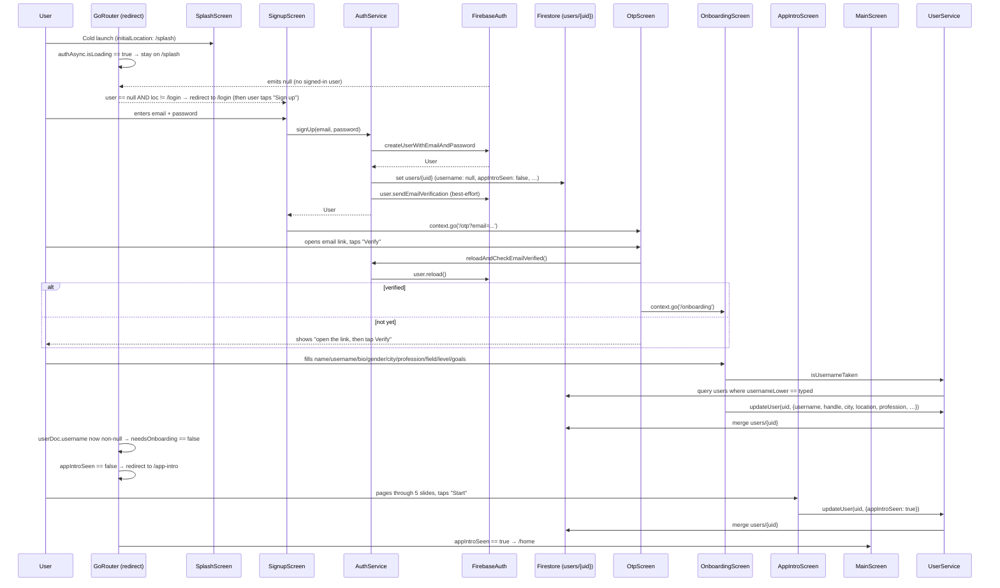

# Flow 01 — Signup, OTP, Onboarding, App Intro

End-to-end journey from a fresh app install to a fully-onboarded user landing on `/home`. Covers email/password sign-up; the OAuth (Google/Apple) variants are noted in passing — see [02-login-flow.md](02-login-flow.md) for those.

## Sequence



## Numbered steps

1. **Cold launch / initial route.** [`routerProvider`](../../lib/src/router/app_router.dart) sets `initialLocation: '/splash'`. [`SplashScreen`](../../lib/src/features/screens/auth/splash_screen.dart) is purely a brand surface with a spinner — it does no work itself.

2. **Auth gate evaluates.** [`app_router.dart`](../../lib/src/router/app_router.dart) `redirect` runs:
   - While `authStateProvider.isLoading` → stays on current location.
   - `authStateProvider` (see [`auth_providers.dart`](../../lib/src/providers/auth_providers.dart)) is a `StreamProvider<User?>` wrapping `FirebaseAuth.authStateChanges()`; on each user it pre-warms an ID token before yielding so Firestore streams don't open with an expired token.
   - With no signed-in user and loc not in the auth flow set (`/login`, `/signup`, `/forgot-password`, `/otp`), router pushes `/login`.

3. **User taps "Sign up" on login.** Navigates to `/signup` (no Firestore writes yet).

4. **Sign-up form submit.** [`SignupScreen._submit`](../../lib/src/features/screens/auth/signup_screen.dart):
   - Client-side validates email (regex) + password (≥8 chars, letter + digit) + confirm match.
   - Calls `authServiceProvider.signUp(email, password)`.

5. **`AuthService.signUp`.** [`auth_service.dart`](../../lib/src/services/auth_service.dart):
   ```
   FirebaseAuth.createUserWithEmailAndPassword
   → set Firestore users/{uid} (full default doc with username: null, appIntroSeen: false, fcmTokens: [])
   → user.sendEmailVerification() (try/catch — non-fatal)
   → justSignedUp = true
   ```
   Firestore write at `users/{uid}` includes: `uid`, `email`, `username: null`, `handle: null`, `bio: ''`, `avatarUrl: null`, `gender: null`, `role: 'user'`, `suspended: false`, `isPrivate: false`, `appIntroSeen: false`, counts at 0, `fcmTokens: []`, `createdAt: serverTimestamp`.

6. **Router observes the new user.** `_AuthListenable` in `app_router.dart` notifies on auth + user-doc change. Because `authServiceProvider.requiresEmailVerification` is true (email present + `emailVerified == false`), the redirect pushes `/otp?email=...`. The signup screen also explicitly calls `context.go('/otp?email=...')` after `signUp` resolves, so it lands there even faster.

7. **OTP screen.** [`OtpScreen`](../../lib/src/features/screens/auth/otp_screen.dart):
   - "Verify" → `AuthService.reloadAndCheckEmailVerified()` reloads the FirebaseAuth user; if `emailVerified` is now true, navigates to `/onboarding`. Otherwise shows "open the link, then tap Verify".
   - "Resend" → `AuthService.sendEmailVerification()`.
   - Back arrow → `AuthService.discardPendingSignup()` deletes `users/{uid}` and the Auth user (so the email can be reused), then `context.go('/signup')`.

8. **Onboarding screen.** [`OnboardingScreen`](../../lib/src/features/screens/auth/onboarding_screen.dart) collects:
   - Name, username (validated `[a-z0-9._]{3,24}`), bio, gender.
   - Optional location: GPS via `geolocator` → reverse-geocode to city via `geocoding`. City picker also supports manual select (powered by [`city_service.dart`](../../lib/src/services/city_service.dart) / `worldCitiesProvider`).
   - Optional "About you": profession, field, academic level (only when applicable to the profession), goals (multi-select). Options come from [`adminConfigProvider`](../../lib/src/providers/admin_providers.dart) (see [`admin_service.dart`](../../lib/src/services/admin_service.dart) defaults `kProfileProfessionOptions`, `kProfileFieldOptions`, etc.).

9. **Submit onboarding.** `OnboardingScreen._submit`:
   - `UserService.isUsernameTaken(username, excludeUid: uid)` queries Firestore for `usernameLower == typed`.
   - On success, `UserService.updateUser(uid, {name, username, usernameLower, handle, bio, gender, city, location:{lat,lng}, profession, field, academicLevel, goals})` merges into `users/{uid}`.
   - There is **no explicit `context.go('/home')`** at the end — the router's `_routingStateSelector` picks up the username change and re-runs redirect.

10. **Router redirects to App Intro.** Now `username` is non-null but `appIntroSeen == false` → router pushes `/app-intro`.

11. **App intro carousel.** [`AppIntroScreen`](../../lib/src/features/screens/auth/app_intro_screen.dart): 5 slides (posts, discuss, travel, events, translate). "Skip" or "Start" both invoke `_finish()`:
   ```
   userServiceProvider.updateUser(uid, {appIntroSeen: true})
   → context.go('/home')
   ```

12. **Home.** Router's redirect now lets `/home` ([`MainScreen`](../../lib/src/features/model/main_screen.dart)) stand. Triggers FCM init on auth change (see [12-notification-flow.md](12-notification-flow.md)).

## Firestore writes

| Step | Path | Operation |
|------|------|-----------|
| 5 | `users/{uid}` | `set` (full default doc, signup) |
| 7 (cancel) | `users/{uid}` | `delete` (if user backs out of OTP) |
| 9 | `users/{uid}` | `set(merge: true)` via `UserService.updateUser` (profile fields) |
| 11 | `users/{uid}` | `set(merge: true)` with `{appIntroSeen: true}` |

No Cloud Functions fire on these writes — `users/{uid}` triggers are not registered in [`functions/src/index.ts`](../../functions/src/index.ts). The first FCM token write happens later, on first FCM init after sign-in.

## Failure paths

- **Email already exists (step 5).** `FirebaseAuthException(code: 'email-already-in-use')` → `SignupScreen` shows "An account with this email already exists."
- **Weak password / invalid email.** Mapped to friendly strings in `_friendlyError`.
- **Network error during signup.** Auth doc is not created; user sees "Network error. Check your connection and try again." `justSignedUp` stays false.
- **Verification email failed to send (step 5).** Swallowed — OTP screen exposes "Resend" so the user can retry.
- **OTP "Verify" with unverified email.** Inline error: "Please open the verification link in your email, then tap Verify."
- **Username already taken (step 9).** `UserService.isUsernameTaken` returns true → inline error `context.t.authUsernameTaken`. Submit not committed.
- **GPS denied / no location services.** Onboarding falls back to manual city entry; user can still proceed.
- **App-intro save failed (step 11).** Error string surfaced inline; user can retry. Until `appIntroSeen` writes succeed, every subsequent app launch redirects back to `/app-intro`.
- **App killed mid-onboarding.** Because `appIntroSeen` and `username` are persisted in the user doc — *not* in memory — re-opening the app routes them back to `/onboarding` (if username still null) or `/app-intro`. The `justSignedUp` in-memory flag is intentionally not used for routing.

## Related files

- [`lib/src/router/app_router.dart`](../../lib/src/router/app_router.dart) — auth gate redirect logic + `_AuthListenable` selector.
- [`lib/src/services/auth_service.dart`](../../lib/src/services/auth_service.dart) — `signUp`, `discardPendingSignup`, `_defaultUserDoc`.
- [`lib/src/services/user_service.dart`](../../lib/src/services/user_service.dart) — `isUsernameTaken`, `updateUser`.
- [`lib/src/providers/auth_providers.dart`](../../lib/src/providers/auth_providers.dart) — `authStateProvider`, `currentUserDocProvider`.
- [`lib/src/features/screens/auth/splash_screen.dart`](../../lib/src/features/screens/auth/splash_screen.dart)
- [`lib/src/features/screens/auth/signup_screen.dart`](../../lib/src/features/screens/auth/signup_screen.dart)
- [`lib/src/features/screens/auth/otp_screen.dart`](../../lib/src/features/screens/auth/otp_screen.dart)
- [`lib/src/features/screens/auth/onboarding_screen.dart`](../../lib/src/features/screens/auth/onboarding_screen.dart)
- [`lib/src/features/screens/auth/app_intro_screen.dart`](../../lib/src/features/screens/auth/app_intro_screen.dart)
- [`lib/src/services/city_service.dart`](../../lib/src/services/city_service.dart) — `worldCitiesProvider`, `CityPickerField`.
