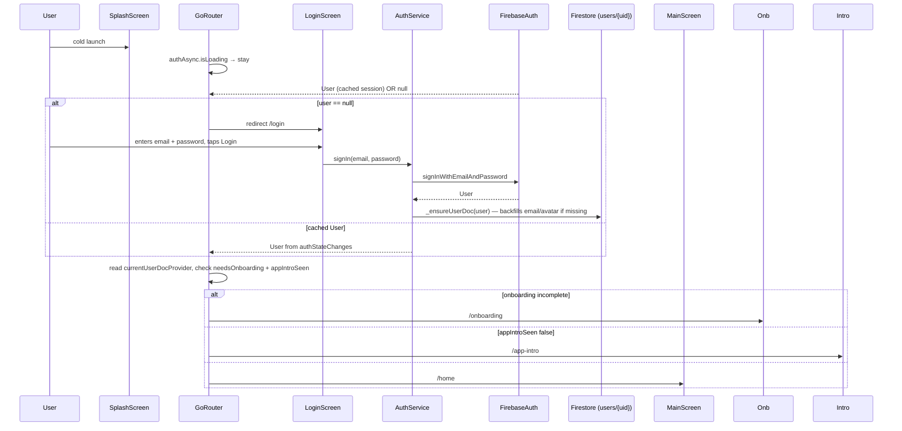

# Flow 02 — Returning-user login

Covers the three paths from app launch to `/home` for a user who already has an account: email/password, Google sign-in, and Apple sign-in. Also the forgot-password sub-flow.

## Sequence (email/password)

## Numbered steps — email/password

1. **Cold launch.** Router lands on `/splash`. [`authStateProvider`](../../lib/src/providers/auth_providers.dart) is `loading`.

2. **`FirebaseAuth.authStateChanges()` emits.** Either the cached `User` (auto sign-in) or `null`.
   - Before yielding the `User`, the stream calls `await user.getIdToken()` and then waits 50 ms so the Firestore SDK's auth listener catches up — avoids the transient `permission-denied` on the first snapshot of `currentUserDocProvider`.

3. **If `User == null`:** [`app_router.dart`](../../lib/src/router/app_router.dart) redirects to `/login`. [`LoginScreen`](../../lib/src/features/screens/auth/login_screen.dart) shows the form.

4. **User submits.** `LoginScreen._submit` → `authServiceProvider.signIn(email, password)`:
   - [`AuthService.signIn`](../../lib/src/services/auth_service.dart) clears `justSignedUp = false`, then `FirebaseAuth.signInWithEmailAndPassword`.
   - On success, calls `_ensureUserDoc(user)` — `get` `users/{uid}`; if missing, `set` the default doc; otherwise patch `email` and `avatarUrl` if the doc is missing them and Auth has a value (idempotent backfill).

5. **`authStateProvider` re-emits the new user.** `_AuthListenable` notifies `GoRouter`.

6. **Router redirect runs again.** With a non-null `User`:
   - `requiresEmailVerification`? For email/password users created before "verify your email" was enforced, `emailVerified` may already be true. If false, route to `/otp` (resends are available there too).
   - `currentUserDocProvider` resolves. If `username` is null/empty → `/onboarding`. Else if `appIntroSeen == false` → `/app-intro`. Else → `/home`.

7. **Home.** Same as flow 01 step 12. Triggers FCM init via the `ref.listen<AsyncValue<User?>>` in [`main.dart`](../../lib/main.dart) (lines 254–273), which on a non-null new user calls `FcmService.init(uid)` and `PresenceService.setOnline(uid)`.

## Google sign-in

[`AuthService.signInWithGoogle(intent: GoogleAuthIntent.login)`](../../lib/src/services/auth_service.dart):

1. `_googleSignIn.signOut()` first → always show the account picker.
2. `GoogleSignIn().signIn()` → returns `GoogleSignInAccount?`. If user cancels, returns `null` and the method returns `null` (no error).
3. Builds `GoogleAuthProvider.credential(accessToken, idToken)` and `FirebaseAuth.signInWithCredential(credential)`.
4. Intent gate: if `intent == login` and `additionalUserInfo.isNewUser == true`, throws `GoogleAuthFlowException('No account found for this Google email…')` and **deletes the freshly-created Auth user** + signs out so they can't slip past the intent check on retry.
5. Otherwise `_ensureUserDoc(user, avatarUrl: user.photoURL)`. For new users (signup intent), also `set users/{uid}` with the full default doc.
6. Router proceeds the same way as email/password.

The signup screen calls the same method with `intent: GoogleAuthIntent.signup`, which treats an existing Google account as a silent login (no error) — see [`signup_screen.dart`](../../lib/src/features/screens/auth/signup_screen.dart) `_signInWithGoogle`.

## Apple sign-in (iOS only)

[`AuthService.signInWithApple()`](../../lib/src/services/auth_service.dart):

1. Generates a random nonce + SHA-256 of it for replay protection.
2. `SignInWithApple.getAppleIDCredential(scopes: [email, fullName], nonce)`.
3. `FirebaseAuth.signInWithCredential(OAuthProvider('apple.com').credential(idToken, rawNonce))`.
4. `_ensureUserDoc(user)`, plus on new users: writes display name from Apple `givenName`/`familyName` and a fresh `users/{uid}` doc.

The login screen renders the Apple button only when `Platform.isIOS`.

## Forgot password sub-flow

[`ForgotPasswordScreen`](../../lib/src/features/screens/auth/forgot_password_screen.dart):

1. User taps "Forgot password?" on login → `context.push('/forgot-password')`.
2. Enters email, taps "Send reset link" → `AuthService.resetPassword(email)` → `FirebaseAuth.sendPasswordResetEmail(email)`.
3. On success, screen flips to the green "Email sent" success state with "Back to login".
4. Errors mapped: `invalid-email`, `user-not-found`, `too-many-requests`, `network-request-failed`.

No Firestore writes. Firebase Auth handles the entire reset email/link flow server-side.

## Firestore reads / writes

| Step | Path | Operation |
|------|------|-----------|
| 4 | `users/{uid}` | `get` (in `_ensureUserDoc`); `set` (only if doc missing) or `set(merge: true)` with `{email, avatarUrl}` if those fields were empty |
| router gate | `users/{uid}` | `snapshots()` via `currentUserDocProvider` |
| FCM init (post-home) | `users/{uid}` | `set(merge: true, {fcmTokens: arrayUnion([token])})` — see [`FcmService._saveToken`](../../lib/src/services/fcm_service.dart) |

No Cloud Functions fire on login itself.

## Failure paths

- **Wrong email/password.** `FirebaseAuthException` codes `user-not-found`, `wrong-password`, `invalid-credential`, `invalid-login-credentials` all map to "Incorrect email or password." (single message — intentional, to avoid leaking which half is wrong).
- **Account disabled.** `user-disabled` → "This account has been disabled."
- **Too many attempts.** `too-many-requests` → "Too many attempts. Please try again in a few minutes."
- **Network error.** `network-request-failed` → "Network error. Check your connection and try again."
- **Google flow — wrong intent.** `GoogleAuthFlowException` (login intent + new account, *or* signup intent + existing account — actually the signup path silently logs in; only the login intent throws).
- **Google account picker dismissed.** `signInWithGoogle` returns `null` — no error UI shown, just stays on login.
- **Apple sign-in failed.** Falls through to generic "Apple sign-in failed."
- **Doc deleted while logged in.** [`main.dart`](../../lib/main.dart) lines 282–290 listens on `currentUserDocProvider`; if value goes present → missing (e.g. admin deletes the user from the dashboard), calls `AuthService.signOut()`. The session can't keep going on a "ghost" user.
- **Token stale → `permission-denied` on first Firestore snapshot.** Mitigated by the 50 ms grace inside `authStateProvider`, plus `_retryStream` in `currentUserDocProvider` retries up to 3 times with exponential backoff.

## Related files

- [`lib/src/router/app_router.dart`](../../lib/src/router/app_router.dart)
- [`lib/src/services/auth_service.dart`](../../lib/src/services/auth_service.dart)
- [`lib/src/providers/auth_providers.dart`](../../lib/src/providers/auth_providers.dart)
- [`lib/src/features/screens/auth/login_screen.dart`](../../lib/src/features/screens/auth/login_screen.dart)
- [`lib/src/features/screens/auth/forgot_password_screen.dart`](../../lib/src/features/screens/auth/forgot_password_screen.dart)
- [`lib/main.dart`](../../lib/main.dart) — `ref.listen` for FCM init + presence on user change.
- [`lib/src/services/fcm_service.dart`](../../lib/src/services/fcm_service.dart) — writes FCM token to user doc after login.
- [`lib/src/services/presence_service.dart`](../../lib/src/services/presence_service.dart) — flips RTDB online flag.
