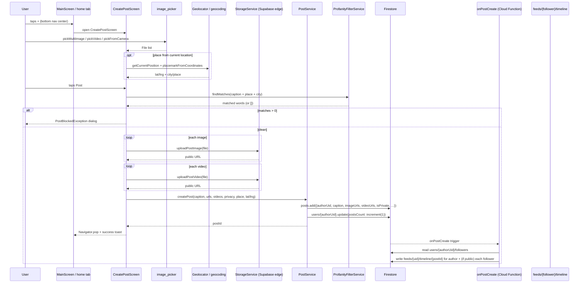

# Flow 03 — Create post

User opens the post composer → picks media → fills caption + place → publishes → post appears in feeds and fans out to follower timelines.

## Sequence



## Numbered steps

1. **Entry point.** User taps the center `+` in the bottom navigation in [`MainScreen`](../../lib/src/features/model/main_screen.dart). It opens [`CreatePostScreen`](../../lib/src/features/screens/create_post_screen.dart). Also reachable from the home tab compose button.

2. **Warm city picker.** `initState` kicks off `worldCitiesProvider.future` so the city picker opens instantly later. See [`city_service.dart`](../../lib/src/services/city_service.dart).

3. **Pick media.**
   - `_pickImages` → `ImagePicker().pickMultiImage(imageQuality: 85, maxWidth: 1600)` (gallery, multi).
   - `_pickFromCamera` → camera, single image.
   - `_pickVideoFromGallery` / `_pickVideoFromCamera` → 2-min max duration. `_ensureVideoUnderLimit` rejects > 30 MB (`_maxVideoBytes`).

4. **Caption + place.**
   - Caption: free text, multiline, up to user's keyboard limits.
   - Place name (`postPlaceName`) + city (`postPlaceCity`, via `CityPickerField`).
   - "Use current location" → `Geolocator.getCurrentPosition(accuracy: medium)` + `geo.placemarkFromCoordinates` to autofill city/place (sets `_placeFromCurrentLocation = true` — this becomes `postLocationExact` on the post doc).
   - "Locate on map" → `geo.locationFromAddress("$name, $city")` to drop a pin without geolocating the device.

5. **Privacy chip.** Defaults to followers-only when the user's account `isPrivate == true` (one-shot `_privacyDefaultApplied` guard). User can flip the chip per post.

6. **Tap Post → `_submit`.**
   - Empty check: rejects when caption + images + videos are all empty.
   - If place name typed but lat/lng not set, late-geocodes via `geo.locationFromAddress`.
   - Uploads each picked image: `StorageService.uploadPostImage(file)` — backed by a Supabase edge function (`bucket: 'posts', kind: 'post'`). Returns a public URL. See [`storage_service.dart`](../../lib/src/services/storage_service.dart).
   - Uploads each picked video: `StorageService.uploadPostVideo(file)` (`kind: 'post-video'`).

7. **`PostService.createPost`.** [`post_service.dart`](../../lib/src/services/post_service.dart) lines 54–131:
   - Reads `users/{uid}` for author username + avatar (used to denormalize onto the post doc).
   - `ProfanityFilterService.findMatches(caption + placeName + placeCity)`. On any match → throws `PostBlockedException(matches)`.
   - Otherwise `posts.add({…})` with fields:
     ```
     authorUid, authorUsername, authorAvatar, caption,
     imageUrls, videoUrls, likesCount: 0, commentsCount: 0,
     isPrivate, createdAt: serverTimestamp,
     postPlaceName, postPlaceCity, postLocation: {lat, lng},
     postLocationExact, placeSearchKey: '$name $city'.toLowerCase()
     ```
   - Updates `users/{authorUid}.postsCount` with `FieldValue.increment(1)`.
   - Returns the new post id.

8. **UI returns.** `Navigator.pop(context)` + `AppFeedback.showSuccessOn(messenger, …)` snackbar.

9. **Cloud Function `onPostCreate` fires.** [`functions/src/posts.ts`](../../functions/src/posts.ts):
   - Reads `users/{authorUid}/followers`.
   - Builds `targetUids = {authorUid}`; if `!isPrivate`, adds every follower id.
   - For each target, writes `feeds/{uid}/timeline/{postId}` with `{postId, authorUid, createdAt}` — chunked in batches of 450 to stay under the Firestore batch limit.
   - This is the fan-out-on-write timeline. The home feed reads from this collection (see `feedProvider` in [`post_providers.dart`](../../lib/src/providers/post_providers.dart) — note: it actually reads from `posts.orderBy('createdAt')` directly + filters; the `feeds/{uid}/timeline` is for future use / alternate query paths).

10. **Post is now visible.** `streamFeed` in `PostService` reads `posts.orderBy('createdAt', descending: true).limit(200)`, skipping `postType == 'qa'`. The home `feedProvider` adds client-side filters: blocked authors removed, private posts only visible to followers + self. Followers' home will update via snapshot listener.

## Firestore writes

| Step | Path | Operation |
|------|------|-----------|
| 7 | `posts/{id}` | `add` (new doc) |
| 7 | `users/{authorUid}` | `update({postsCount: increment(1)})` |
| 9 (CF) | `feeds/{uid}/timeline/{postId}` | `set({postId, authorUid, createdAt})` for author + each non-blocked follower (if `!isPrivate`) |

## Storage

- Images: Supabase bucket `posts`, kind `post` (path `posts/images/...`).
- Videos: Supabase bucket `posts`, kind `post-video` (path `posts/videos/...`).
- Uploads go through a Supabase Edge Function (`issue-upload-url`) that returns a signed URL; the file is then PUT directly to Supabase Storage. See [`storage_service.dart` `_uploadViaEdge`](../../lib/src/services/storage_service.dart).

## Cloud Functions triggered

- [`onPostCreate`](../../functions/src/posts.ts) — runs on `posts/{postId}` create. Fans out to follower timelines.
- Post creation itself does **not** fan out notifications to followers — there's no "new post by someone you follow" notification.

## Failure paths

- **Empty post (no caption + no media).** Snackbar `createPostAddCaptionImageVideo`, no submit.
- **Video > 30 MB.** `_ensureVideoUnderLimit` shows `createPostVideoTooLarge($mb)` and won't add the file to the picked list.
- **Image upload failed.** Caught in `_submit`, rolls up to `AppFeedback.showError`. No partial post — `posts.add` only runs after every URL has been collected. Already-uploaded files stay on Supabase (orphans).
- **Video upload failed.** Same — exception rethrown, `createPost` never called.
- **Profanity match.** `PostService.createPost` throws `PostBlockedException(matchedWords)`. UI catches and shows the `createPostBlockedTitle` / `createPostBlockedBody` AlertDialog. Already-uploaded media is again orphaned.
- **Firestore add failed.** `createPost` rethrows. No `postsCount` increment (the increment is sequential after the add). UI shows error.
- **Cloud Function failure.** `onPostCreate` failure is silent — the post is still in `posts/{id}`. Affected followers won't get the timeline doc; their feed still surfaces the post via the global `streamFeed` (which queries `posts` directly).
- **Geocoding failed.** `geo.locationFromAddress` swallowed in try/catch — post gets saved without coordinates.

## Related files

- [`lib/src/features/screens/create_post_screen.dart`](../../lib/src/features/screens/create_post_screen.dart)
- [`lib/src/services/post_service.dart`](../../lib/src/services/post_service.dart)
- [`lib/src/services/storage_service.dart`](../../lib/src/services/storage_service.dart)
- [`lib/src/services/profanity_filter_service.dart`](../../lib/src/services/profanity_filter_service.dart)
- [`lib/src/services/city_service.dart`](../../lib/src/services/city_service.dart)
- [`lib/src/providers/post_providers.dart`](../../lib/src/providers/post_providers.dart) — `feedProvider`, `postServiceProvider`.
- [`functions/src/posts.ts`](../../functions/src/posts.ts) — `onPostCreate` fan-out.
