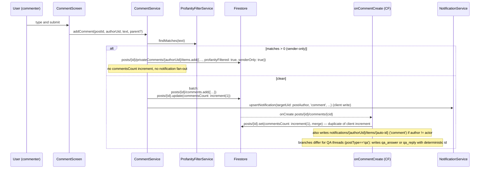

# Flow 04 — Like and comment a post

User taps the heart on a post; later, types a comment. Both writes propagate to a notification doc on the author and (if the author has FCM tokens) trigger a push.

## Sequence — like

```mermaid
sequenceDiagram
  participant U as User (liker)
  participant Card as PostCard
  participant PP as postServiceProvider / isLikedProvider
  participant PS as PostService
  participant FS as Firestore
  participant CF1 as onLikeCreate (CF)
  participant CF2 as sendPushOnNotificationCreate (CF)
  participant Author as Author device

  U->>Card: tap heart
  Card->>PS: toggleLike(postId)
  PS->>FS: transaction
  Note over FS: read post → read like doc<br/>add or delete likes/{uid}<br/>increment likesCount ±1
  PS->>FS: notifications/{authorUid}/items.upsert<br/>(client-written 'like' notif)
  FS-->>CF1: onCreate posts/{id}/likes/{uid}
  CF1->>FS: notifications/{authorUid}/items.add({type: 'like', actorUid, targetId, read: false})
  Note over CF1,PS: NB: client also writes this with a deterministic id; CF write has an auto-id<br/>so there can be 2 notification docs per like in the current setup.
  FS-->>CF2: onCreate notifications/{uid}/items/{nid}
  CF2->>FS: read users/{uid}.fcmTokens
  CF2->>Author: FCM multicast push (title "New like", body "{actor} liked your post")
```

## Sequence — comment



## Numbered steps — like

1. **User taps the heart** on a [`PostCard`](../../lib/src/features/widgets/post_card.dart). The icon state comes from `isLikedProvider(postId)` ([`post_providers.dart`](../../lib/src/providers/post_providers.dart) line 129), which streams `posts/{id}/likes/{uid}.snapshots()`.

2. **`PostService.toggleLike`** ([`post_service.dart`](../../lib/src/services/post_service.dart) lines 689–731):
   - Starts a Firestore transaction:
     - Reads `posts/{id}` (for `authorUid`).
     - Reads `posts/{id}/likes/{uid}`.
     - If like exists: deletes it + decrements `likesCount`.
     - Else: writes `{createdAt: serverTimestamp}` + increments `likesCount`.

3. **Client-side notification (Spark fallback).** After the transaction, if `authorUid != currentUid`:
   - On a new like: `NotificationService.upsertNotification(targetUid: authorUid, docId: 'like_${actorUid}_${postId}', type: 'like', actorUid, targetId: postId)`. The deterministic id means like → unlike → like never piles up duplicates.
   - On unlike: `removeNotificationById(authorUid, 'like_…_…')`.

4. **Cloud Function `onLikeCreate` fires.** [`functions/src/likes.ts`](../../functions/src/likes.ts) listens on `posts/{postId}/likes/{likerUid}`:
   - Looks up `posts/{postId}` for `authorUid`.
   - Skips if `authorUid == likerUid`.
   - Writes `notifications/{authorUid}/items.add({type: 'like', actorUid: likerUid, targetId: postId, read: false, createdAt: serverTimestamp})` — *with an auto-generated id*, separate from the client's deterministic-id doc.

   > **Heads up — duplicate notifications.** With both the client `upsertNotification` and the Cloud Function `add`, the author gets two notification docs per like event. The client uses a fixed id (`like_<actor>_<post>`) and is the path that gets cleaned up on unlike; the CF auto-id doc is leftover. This is presumably intentional Spark-plan resilience (CFs may not be deployed), but be aware when reading notification counts.

5. **Cloud Function `sendPushOnNotificationCreate` fires.** [`functions/src/notifications.ts`](../../functions/src/notifications.ts):
   - Reads `users/{authorUid}.fcmTokens`.
   - Resolves actor username from `users/{actorUid}`.
   - Maps the type to a title/body (`like` → "New like" / "{actor} liked your post").
   - `admin.messaging().sendEachForMulticast({tokens, notification: {title, body}, data: {type, actorUid, targetId}})`.

## Numbered steps — comment

1. **User opens comments** via [`CommentScreen`](../../lib/src/features/screens/comment_screen.dart) (from the comment button on a post card) and submits text. Replies pass `parentCommentId` + `replyToUsername`.

2. **`CommentService.addComment`** ([`comment_service.dart`](../../lib/src/services/comment_service.dart) lines 192–325):
   - Runs `ProfanityFilterService.findMatches(text)`.
   - **Clean path**: batch-writes
     - `posts/{id}/comments/{newId}` with `{authorUid, authorUsername, authorAvatar, text, createdAt, likesCount: 0, helpfulCount: 0, unhelpfulCount: 0, parentCommentId?, replyToUsername?}`.
     - `posts/{id}.update({commentsCount: increment(1)})`.
   - **Profanity path**: writes to `posts/{id}/privateComments/{authorUid}/items/{newId}` with `profanityFiltered: true, senderOnly: true`. Does not touch `commentsCount`. **Returns early — no notifications.**

3. **Client notification fan-out (Spark fallback).** After the batch commit:
   - **QA post** (`postType == 'qa'`):
     - Top-level comment → notify question author with `qa_answer_${postId}_${commentId}_${actor}` / type `qa_answer`.
     - Reply → notify parent comment's author with `qa_reply_${postId}_${commentId}_${actor}` / type `qa_reply`.
   - **Regular post**:
     - Top-level comment → notify post author with `comment_${postId}_${commentId}_${actor}` / type `comment`.
     - Reply → notify parent comment's author with `reply_${postId}_${commentId}_${actor}` / type `reply`.
   - All use `upsertNotification` with a deterministic `docId` so the entry is unique per (post, comment, actor). Includes `commentId` on the notification so tapping it can scroll to + highlight the specific comment.

4. **Cloud Function `onCommentCreate` fires.** [`functions/src/comments.ts`](../../functions/src/comments.ts) listens on `posts/{postId}/comments/{commentId}`:
   - Reads the post for `authorUid` + `postType`.
   - Batch:
     - `posts/{postId}.set({commentsCount: increment(1)}, merge)` — duplicate of client increment, leaves the post counter off by +1 if both fire. (See "duplicate notifications" warning above; same caveat applies to `commentsCount`.)
     - For QA top-level → write `qa_answer_${postId}_${commentId}_${actor}` notif on the question author.
     - For QA reply → read parent comment, write `qa_reply_${…}` on the parent's author.
     - For regular post non-self comment → write a comment notification with **auto-id** on the post author.

   > The deterministic-id CFs (QA) collapse on top of client-written notifications. The auto-id CF (regular comment) creates a duplicate alongside the client's deterministic doc.

5. **`sendPushOnNotificationCreate` fires** for each new notification doc. Push payloads:
   - `comment` → "New comment" / "{actor} commented on your post".
   - `qa_answer` → "New answer" / "{actor} answered your question".
   - `reply` / `qa_reply` → "New reply" / "{actor} replied to you".

## Comment likes / answer reactions

[`CommentService.toggleLikeComment`](../../lib/src/services/comment_service.dart):
- Transaction on `posts/{id}/comments/{cid}/likes/{uid}` ± `likesCount`.
- Client-writes a `comment_like` notification with id `comment_like_${commentId}_${actor}` on the comment author (deletes it on unlike).

[`CommentService.setAnswerReaction`](../../lib/src/services/comment_service.dart) (Q&A only):
- Writes `posts/{id}/comments/{cid}/reactions/{uid}` with `{type: 'heart'|'broken'}`.
- Adjusts `helpfulCount` / `unhelpfulCount` on the comment.
- Client-writes `qa_answer_like` / `qa_answer_dislike` notifications with deterministic ids.
- Cloud Function `onQaAnswerReactionWrite` ([`functions/src/comments.ts`](../../functions/src/comments.ts) line 84) **also** writes/deletes the same notification docs with the same deterministic ids, so this path is duplicate-safe (the two writes collapse via merge on the same doc id).

## Firestore writes

| Step | Path | Operation |
|------|------|-----------|
| like | `posts/{id}/likes/{uid}` | `set` / `delete` (in transaction) |
| like | `posts/{id}` | `update({likesCount: ±1})` (in transaction) |
| like (client notif) | `notifications/{authorUid}/items/like_{actor}_{post}` | `set` |
| like (CF notif) | `notifications/{authorUid}/items/{auto-id}` | `add` |
| comment | `posts/{id}/comments/{cid}` | `add` (in batch) |
| comment | `posts/{id}` | `update({commentsCount: +1})` (in batch + CF — see warning) |
| profanity comment | `posts/{id}/privateComments/{senderUid}/items/{cid}` | `add` |
| comment (client notif) | `notifications/{authorUid}/items/{deterministic-id}` | `set` |
| comment (CF notif, regular) | `notifications/{authorUid}/items/{auto-id}` | `set` |
| comment like | `posts/{id}/comments/{cid}/likes/{uid}` | transaction |
| QA answer reaction | `posts/{id}/comments/{cid}/reactions/{uid}` | transaction |

## Cloud Functions triggered

- [`onLikeCreate`](../../functions/src/likes.ts) — writes a like notification.
- [`onCommentCreate`](../../functions/src/comments.ts) — increments `commentsCount`; writes comment / qa_answer / qa_reply notifications.
- [`onQaAnswerReactionWrite`](../../functions/src/comments.ts) — writes/deletes qa_answer_like / qa_answer_dislike notifications.
- [`sendPushOnNotificationCreate`](../../functions/src/notifications.ts) — multicasts FCM to all `fcmTokens` on the recipient user doc.

## Failure paths

- **Not signed in.** Service throws `Exception('Not signed in')`; UI swallows / shows generic error toast.
- **Transaction conflict on rapid double-tap.** Firestore retries automatically.
- **Profanity in comment text.** Comment is written to the user's private subcollection only; visible only to them in the comments list. No notifications fire. The UI doesn't reject — the comment just looks "sent" to the author. The author can edit it to clean it up via `editComment`, which promotes it back to public.
- **Notification write failed.** `try/catch` in service methods is best-effort — the like/comment is still saved. The CF will still write its copy when it runs.
- **CF skipped / not deployed.** The client-written notification still appears in the recipient's notification list, but the FCM push won't fire (push only fires from `sendPushOnNotificationCreate`).
- **Comment delete.** `deleteComment` removes the comment doc, decrements `commentsCount`, and best-effort deletes the matching deterministic notification doc on the recipient's items collection. The auto-id CF-written notification leaks.

## Related files

- [`lib/src/services/post_service.dart`](../../lib/src/services/post_service.dart) — `toggleLike`, `streamIsLiked`.
- [`lib/src/services/comment_service.dart`](../../lib/src/services/comment_service.dart) — `addComment`, `editComment`, `deleteComment`, `toggleLikeComment`, `setAnswerReaction`.
- [`lib/src/services/notification_service.dart`](../../lib/src/services/notification_service.dart) — `upsertNotification`, `removeNotificationById`.
- [`lib/src/services/profanity_filter_service.dart`](../../lib/src/services/profanity_filter_service.dart)
- [`lib/src/providers/post_providers.dart`](../../lib/src/providers/post_providers.dart) — `isLikedProvider`.
- [`lib/src/providers/comment_providers.dart`](../../lib/src/providers/comment_providers.dart)
- [`lib/src/features/widgets/post_card.dart`](../../lib/src/features/widgets/post_card.dart) — like/comment buttons.
- [`lib/src/features/screens/comment_screen.dart`](../../lib/src/features/screens/comment_screen.dart)
- [`functions/src/likes.ts`](../../functions/src/likes.ts)
- [`functions/src/comments.ts`](../../functions/src/comments.ts)
- [`functions/src/notifications.ts`](../../functions/src/notifications.ts)
