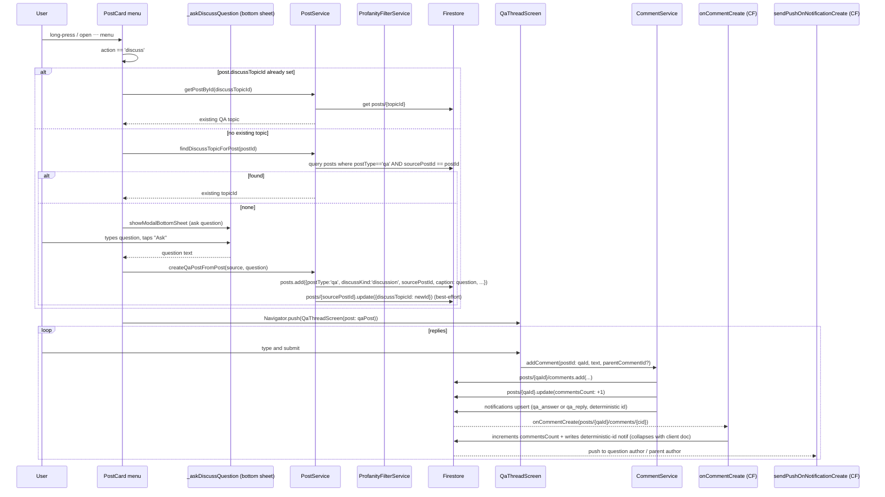

# Flow 05 — "Discuss this post" → Q&A thread

A regular feed post can be turned into a Discuss (Q&A) topic. The Discuss topic lives in the same `posts` collection but is tagged `postType: 'qa'`, with `sourcePostId` pointing at the original. Replies are stored as comments on the QA doc.

## Sequence

## Numbered steps

1. **Open the Discuss action.** In [`post_card.dart`](../../lib/src/features/widgets/post_card.dart), the post menu (`_OwnerMenu` for own post, viewer menu for others) includes a `value: 'discuss'` entry whose label flips between `postCardViewInDiscuss` (when `post.discussTopicId != null`) and `postCardDiscussThisPost`. Tapping it calls `discussPost(context, ref, post)`.

2. **Resolve existing topic** (`post_card.dart` lines 2202–2241):
   - `var topicId = post.discussTopicId ?? await postService.findDiscussTopicForPost(post.id)`.
   - `findDiscussTopicForPost` (in [`post_service.dart`](../../lib/src/services/post_service.dart) lines 360–368) runs `posts.where('postType', '==', 'qa').where('sourcePostId', '==', postId).limit(1)`. If it finds one, returns its id.

3. **If no topic exists → ask the user.** `_askDiscussQuestion(context)` ([`post_card.dart` line 2246](../../lib/src/features/widgets/post_card.dart)) shows a bottom sheet with a multiline `TextField` and an "Ask" button. Returns the trimmed question, or `null` on dismiss.

4. **Create the QA topic.** `PostService.createQaPostFromPost(source, question: ...)` ([`post_service.dart`](../../lib/src/services/post_service.dart) lines 277–318):
   - Double-checks for an existing topic (race-safe).
   - Reads the user doc for username/avatar.
   - `posts.add({authorUid, authorUsername, authorAvatar, caption: question, imageUrls: [], likesCount: 0, commentsCount: 0, isPrivate: false, postType: 'qa', discussKind: 'discussion', sourcePostId: source.id, createdAt: serverTimestamp})`.
   - Best-effort: `posts/{sourcePostId}.update({discussTopicId: newId})` so the original post's menu can flip to "View in Discuss" next time.
   - Note: profanity filtering happens in `createQaPost` (asked-from-scratch path) but **not** in `createQaPostFromPost` — questions about an existing post are not run through the profanity filter on creation.

5. **Open the thread.** `discussPost` does `Navigator.push(MaterialPageRoute(builder: (_) => QaThreadScreen(post: qaPost)))`. The original post is rendered as an embedded card inside the QA thread (via `sourcePostId` lookup + `singlePostProvider`).

6. **Discuss home tab.** Separately, the Discuss tab in [`MainScreen`](../../lib/src/features/model/main_screen.dart) lists QA posts via `qaFeedProvider` → [`PostService.streamQaFeed`](../../lib/src/services/post_service.dart) (lines 372–387) → `posts.where('postType', '==', 'qa').limit(240).snapshots()`, sorted client-side by `createdAt` desc. So new Discuss topics appear there automatically, alongside questions asked from scratch via the Discuss compose button (`PostService.createQaPost`).

7. **Reply / answer.** In [`QaThreadScreen._submitAnswer`](../../lib/src/features/screens/qa_thread_screen.dart):
   - `commentServiceProvider.addComment(postId: widget.post.id, authorUid, authorUsername, authorAvatar, text, parentCommentId, replyToUsername)`.
   - `parentCommentId` is set when replying to an answer; otherwise null (a top-level answer to the question).

8. **`CommentService.addComment` on a QA post.** See [04-like-comment-flow.md](04-like-comment-flow.md) for the full diagram. Key QA-specific bits:
   - Writes `posts/{qaId}/comments/{cid}` with the same schema as regular comments.
   - Profanity match → goes to `privateComments/{senderUid}/items` (sender-only), no notifications.
   - Clean top-level reply → notifies the question author with deterministic id `qa_answer_${qaId}_${cid}_${actor}` / type `qa_answer`.
   - Clean nested reply → notifies the parent answer's author with `qa_reply_${qaId}_${cid}_${actor}` / type `qa_reply`.
   - Cloud Function `onCommentCreate` detects `postType == 'qa'` and writes the same deterministic-id notification (collapses with client write via merge).

9. **Reactions on an answer.** Tapping ❤️ / 💔 on an answer calls `setAnswerReaction(type: 'heart' | 'broken')` ([`comment_service.dart` lines 569–669](../../lib/src/services/comment_service.dart)):
   - Transactional: writes `posts/{qaId}/comments/{cid}/reactions/{uid}` with `{type, createdAt}`, plus adjusts `helpfulCount` / `unhelpfulCount` on the comment doc.
   - Notification fan-out (only on QA posts): `qa_answer_like` or `qa_answer_dislike` with deterministic id. CF `onQaAnswerReactionWrite` writes the same id so client + CF collapse.

## Firestore writes

| Step | Path | Operation |
|------|------|-----------|
| 4 | `posts/{newQaId}` | `add({postType:'qa', discussKind:'discussion', sourcePostId, ...})` |
| 4 | `posts/{sourcePostId}` | `update({discussTopicId: newQaId})` (best-effort) |
| 8 | `posts/{qaId}/comments/{cid}` | `add` (or `privateComments/...` for sender-only) |
| 8 | `posts/{qaId}` | `update({commentsCount: +1})` + CF merge with same field |
| 8 | `notifications/{questionAuthor}/items/qa_answer_...` | upsert (client + CF) |
| 9 | `posts/{qaId}/comments/{cid}/reactions/{uid}` | transaction |

## Cloud Functions triggered

- [`onCommentCreate`](../../functions/src/comments.ts) — increments `commentsCount`, writes `qa_answer` / `qa_reply` notifications.
- [`onQaAnswerReactionWrite`](../../functions/src/comments.ts) — writes / deletes `qa_answer_like` / `qa_answer_dislike` notifications when a reaction is set / cleared / changed.
- [`sendPushOnNotificationCreate`](../../functions/src/notifications.ts) — multicasts FCM to recipients.

## Failure paths

- **User cancels question sheet.** Returns `null` → `discussPost` exits, no writes.
- **Network error during `createQaPostFromPost`.** Whole function rethrows; UI catches at `discussPost` and shows `postCardDiscussFailed(e)` snackbar.
- **`update(discussTopicId)` fails.** Swallowed — the lookup-by-`sourcePostId` path still works, so future "Discuss this post" taps still resolve to the same topic.
- **Race: two users tap "Discuss" simultaneously.** Possible — `findDiscussTopicForPost` and `createQaPostFromPost` are not transactional. In the worst case two QA topics for one source post get created. The duplicate `update(discussTopicId)` writes whichever comes last; the first-found-by-query wins on later resolution. Not currently de-duped.
- **Reply with profanity.** Goes to `privateComments` (sender-only), invisible to others, no notifications. The replier sees their own answer pinned at the top of the merged list (see `streamComments` in `CommentService`).

## Related files

- [`lib/src/features/widgets/post_card.dart`](../../lib/src/features/widgets/post_card.dart) — `discussPost`, `_askDiscussQuestion`, `_OwnerMenu`.
- [`lib/src/features/screens/qa_thread_screen.dart`](../../lib/src/features/screens/qa_thread_screen.dart)
- [`lib/src/services/post_service.dart`](../../lib/src/services/post_service.dart) — `createQaPost`, `createQaPostFromPost`, `findDiscussTopicForPost`, `streamQaFeed`.
- [`lib/src/services/comment_service.dart`](../../lib/src/services/comment_service.dart) — QA branches in `addComment`, `setAnswerReaction`.
- [`lib/src/providers/post_providers.dart`](../../lib/src/providers/post_providers.dart) — `qaFeedProvider`, `singlePostProvider`.
- [`functions/src/comments.ts`](../../functions/src/comments.ts) — `onCommentCreate` QA branches, `onQaAnswerReactionWrite`.
