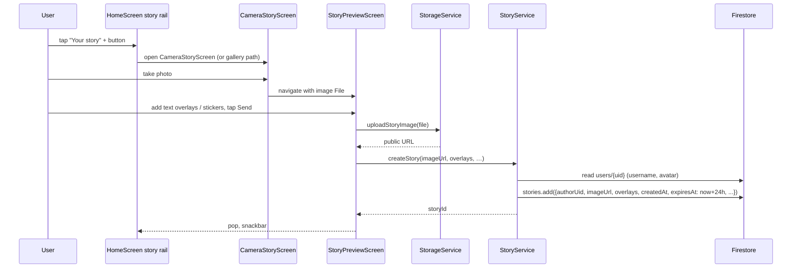
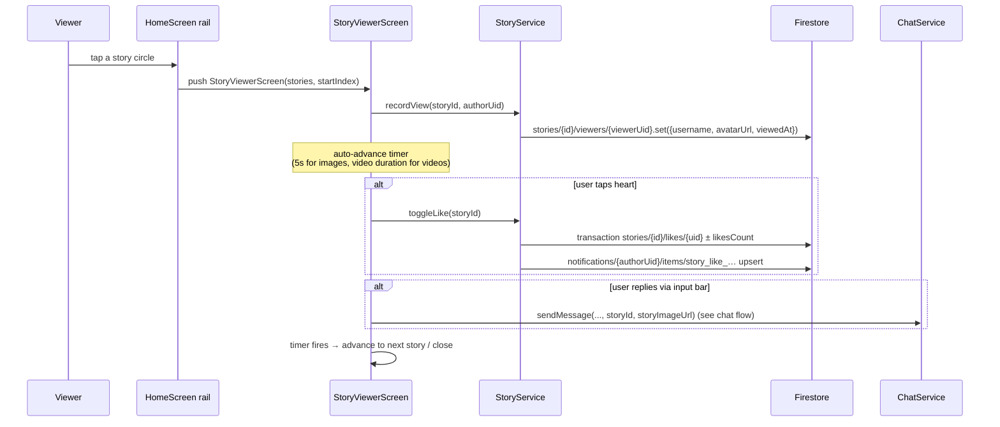

# Flow 06 — Stories (create, view, expire)

Stories are 24-hour ephemeral posts. They can be image (gallery / camera), video, text-only, or a "share this post" overlay on top of an existing feed post. They appear in the home story rail above the feed.

## Sequence — create image story (camera path)

## Sequence — view a story

## Numbered steps — create

### Image story (gallery / camera)

1. **Entry.** Story rail in [`HomeScreen`](../../lib/src/features/screens/home_screen.dart) shows the user's own "+ Your story" circle. Tapping it opens [`CameraStoryScreen`](../../lib/src/features/screens/camera_story_screen.dart) (or a gallery picker — see the screen for the source toggle).

2. **Preview & overlay.** After the user shoots/picks the image, [`StoryPreviewScreen`](../../lib/src/features/screens/story_preview_screen.dart) lets them add `StoryTextOverlay`s (text bubbles, colors, positions). Overlays are persisted both burned-in to the final image (for crisp legacy rendering) AND as structured data so the viewer can re-render at any size.

3. **Upload.** `StorageService.uploadStoryImage(file)` ([`storage_service.dart`](../../lib/src/services/storage_service.dart) line 48) → Supabase bucket `posts`, kind `story`. Returns a public URL.

4. **`StoryService.createStory`.** [`story_service.dart`](../../lib/src/services/story_service.dart) lines 151–195:
   - Reads `users/{uid}` for `username` + `avatarUrl` (denormalized onto the story).
   - `stories.add({authorUid, authorUsername, authorAvatar, imageUrl, overlays: [...], createdAt: serverTimestamp, expiresAt: Timestamp.fromDate(now+24h)})`.

### Video story

- [`VideoStoryPreviewScreen`](../../lib/src/features/screens/video_story_preview_screen.dart) handles the video case. Upload uses `StorageService.uploadStoryVideo` (kind `story-video`, with fallback to `post-video` if the edge function doesn't accept `story-video` yet — see `storage_service.dart` lines 60–79).
- `createStory(imageUrl: thumbnail, videoUrl: url, videoTrimStartMs?, videoTrimEndMs?, overlays: [...])`.
- The image field still holds a thumbnail used in inbox previews.

### Text-only story

- [`TextStoryComposerScreen`](../../lib/src/features/screens/text_story_composer_screen.dart). User types text on a colored background.
- `createStory(imageUrl: '', textContent, backgroundColor, textColor, textBorderStyle, overlays: [])`. No Storage upload — text is rendered live by the viewer.

### "Add to story" from a feed post

- [`AddToStoryScreen`](../../lib/src/features/screens/add_to_story_screen.dart) takes an existing `Post` and produces a story.
- `createStory(imageUrl: '', sharedPostId: post.id, overlays: [...])`. The viewer renders the post as an embedded card and tapping the card opens the source post.

## Numbered steps — view

1. **Story rail.** [`HomeScreen`](../../lib/src/features/screens/home_screen.dart) reads `storyProvider`s (see [`story_providers.dart`](../../lib/src/providers/story_providers.dart) → `StoryService.streamActiveStories`):
   - `stories.where('expiresAt', '>', now).snapshots()` then client-side sort by `createdAt` ascending.
   - Grouped by author in the rail; "seen" rings are determined by [`own_story_seen_service.dart`](../../lib/src/services/own_story_seen_service.dart) for own stories and the viewer subcollection for others.

2. **Tap a circle** → opens [`StoryViewerScreen`](../../lib/src/features/screens/story_viewer_screen.dart) with the list of stories for that author and a starting index. Auto-advance timer fires per story:
   - Images: 5 s (default).
   - Videos: actual video duration (`VideoPlayerController`).
   - Long-press anywhere → pauses the timer / video.

3. **Record a view.** `StoryService.recordView(storyId, authorUid)` ([`story_service.dart` lines 223–240](../../lib/src/services/story_service.dart)):
   - Skips if viewer is the author.
   - Idempotent: only writes if `viewers/{viewerUid}` doesn't exist.
   - Writes `stories/{id}/viewers/{viewerUid}` with `{username, avatarUrl, viewedAt}`.

4. **Like.** Tap the heart → `StoryService.toggleLike(storyId)`:
   - Transaction on `stories/{id}/likes/{uid}` + `likesCount` field.
   - Notification: client `upsertNotification(targetUid: authorUid, docId: 'story_like_{actor}_{storyId}', type: 'story_like', actorUid, targetId: storyId)`. Deleted on unlike. No Cloud Function for this — purely client-side.

5. **Reply to a story.** Sending a chat-bubble reply from the story input bar goes through `ChatService.sendMessage(...)` with `storyId` and `storyImageUrl` set so the receiver's bubble renders a "Replied to story" header. See [07-chat-flow.md](07-chat-flow.md).

6. **Story comment** (separate from chat reply — used in the comments sheet inside the viewer). `StoryService.addComment(storyId, ...)`:
   - Batch: `stories/{id}/comments/{cid}` add + `stories/{id}.update(commentsCount: +1)`.
   - If `parentCommentId` set: `createNotification(type: 'story_reply', targetUid: parentAuthor, …)`. Else: `createNotification(type: 'story_comment', targetUid: storyAuthor, …)`. These use auto-ids (not deterministic), so multiple comments accumulate distinct notification docs.

## Lifecycle handling (video stories)

[`story_viewer_screen.dart` lines 2507–2538](../../lib/src/features/screens/story_viewer_screen.dart):
- On `AppLifecycleState.paused` or `detached`, the video story tears down its `VideoPlayerController` (free codec).
- On `AppLifecycleState.resumed`, if it was suspended, rebuilds the controller from the last known position.

This matters for the resume flow in [14-app-resume-flow.md](14-app-resume-flow.md).

## Expiry

- **Client-side filter.** `StoryService.streamActiveStories` queries `where('expiresAt', '>', now)`. Expired stories silently disappear from the rail.
- **No Cloud Function deletes the story doc on expiry** — the doc, viewers subcollection, and Supabase media all remain. The query simply hides them. This means orphan Storage files accumulate (intentional trade-off on Spark plan).
- **Manual delete.** `StoryService.deleteStory(storyId)` (lines 216–221) just calls `stories/{id}.delete()`. No subcollection cleanup, no Storage cleanup. The owner triggers this via the viewer's overflow menu.

## Firestore writes

| Step | Path | Operation |
|------|------|-----------|
| create | `stories/{id}` | `add` |
| view | `stories/{id}/viewers/{viewerUid}` | `set` (idempotent) |
| like | `stories/{id}/likes/{uid}` | transaction; `stories/{id}.likesCount` ± 1 |
| like (notif) | `notifications/{authorUid}/items/story_like_{actor}_{story}` | upsert / delete |
| comment | `stories/{id}/comments/{cid}` | add; `stories/{id}.commentsCount: +1` |
| comment notif | `notifications/{recipient}/items/{auto-id}` | add (`story_comment` / `story_reply`) |
| delete | `stories/{id}` | delete (viewers/likes/comments orphaned) |

## Storage

- Image story: bucket `posts`, kind `story`.
- Video story: bucket `posts`, kind `story-video` (fallback `post-video`).
- Text story: no Storage upload.

## Cloud Functions triggered

- [`sendPushOnNotificationCreate`](../../functions/src/notifications.ts) — for `story_like`, `story_comment`, `story_reply` (push title/body fall through to the default branch since none of these are explicitly mapped → "Someone interacted with you"). Heads up: the title is generic.

No `onStoryCreate` / `onStoryDelete` Cloud Functions are registered.

## Failure paths

- **Upload failed.** `StorageException` thrown; preview screen catches and shows an error. The story doc is never created.
- **Permission denied for camera / gallery.** Permission UI handled by `image_picker`. On deny, returns null and the screen stays on the picker step.
- **`createStory` write failed.** Snackbar with error; the Supabase upload is orphaned.
- **`recordView` failed.** Silent — viewing UI is unaffected; just no view counted.
- **Like failed.** Best-effort: transaction may retry; notification write swallows errors.
- **Story already expired by the time the viewer opens it.** The viewer still renders the doc (it was in the snapshot before expiry). Refreshing the rail filters it out next snapshot.

## Related files

- [`lib/src/features/screens/home_screen.dart`](../../lib/src/features/screens/home_screen.dart) — story rail.
- [`lib/src/features/screens/camera_story_screen.dart`](../../lib/src/features/screens/camera_story_screen.dart)
- [`lib/src/features/screens/story_preview_screen.dart`](../../lib/src/features/screens/story_preview_screen.dart)
- [`lib/src/features/screens/text_story_composer_screen.dart`](../../lib/src/features/screens/text_story_composer_screen.dart)
- [`lib/src/features/screens/video_story_preview_screen.dart`](../../lib/src/features/screens/video_story_preview_screen.dart)
- [`lib/src/features/screens/add_to_story_screen.dart`](../../lib/src/features/screens/add_to_story_screen.dart)
- [`lib/src/features/screens/story_viewer_screen.dart`](../../lib/src/features/screens/story_viewer_screen.dart)
- [`lib/src/services/story_service.dart`](../../lib/src/services/story_service.dart)
- [`lib/src/services/own_story_seen_service.dart`](../../lib/src/services/own_story_seen_service.dart)
- [`lib/src/providers/story_providers.dart`](../../lib/src/providers/story_providers.dart)
- [`lib/src/services/storage_service.dart`](../../lib/src/services/storage_service.dart) — `uploadStoryImage`, `uploadStoryVideo`.
