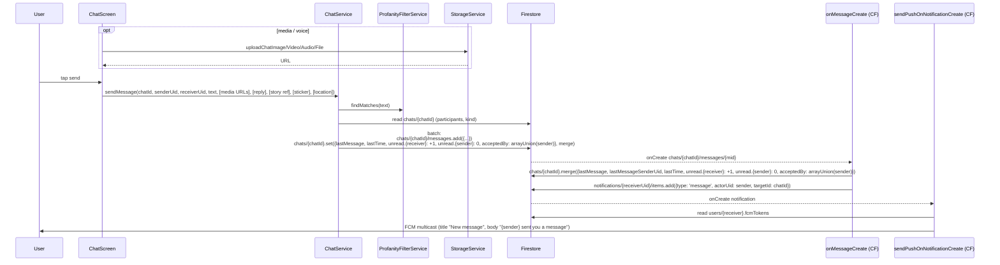

# Flow 07 — 1:1 chat (and group chat)

User opens the inbox → taps a conversation → types/sends a message → message is persisted, mirrored to a Cloud Function that bumps unread + writes a notification (which fans out to a push). Includes typing indicators and presence.

## Sequence — open a chat

```mermaid
sequenceDiagram
  participant U as User
  participant Inbox as MessageScreen
  participant Chat as ChatScreen
  participant CS as ChatService
  participant Cache as MessageCache (on-disk)
  participant FS as Firestore
  participant RTDB as Realtime Database
  participant TS as TypingService
  participant PS as PresenceService

  U->>Inbox: open inbox tab
  Inbox->>FS: chats where participants array-contains uid
  U->>Chat: tap conversation
  Chat->>CS: streamMessages(chatId, uid)
  CS->>Cache: loadSnapshot(chatId) → instant render of last 20 bubbles
  CS->>FS: chats/{chatId}/messages.orderBy('createdAt').snapshots()
  FS-->>CS: live message list
  CS-->>Chat: emits merged list (cache → live)
  Chat->>CS: markSeen(chatId, uid)
  CS->>FS: chats/{chatId}.unread.{uid} = 0; lastSeenAt.{uid} = serverTimestamp
  CS->>FS: bulk update recent messages.seenBy arrayUnion(uid)
  Chat->>PS: listenPresence(otherUid)
  PS->>RTDB: presence/{otherUid} onValue
  Chat->>TS: listenTyping(chatId, otherUid)
  TS->>RTDB: typing/{chatId}/{otherUid} onValue
```

## Sequence — send a message



## Numbered steps

### Open the inbox

1. **[`MessageScreen`](../../lib/src/features/screens/message_screen.dart)** displays "All" / "Requests" tabs reading from `chats` collection via [`chat_providers.dart`](../../lib/src/providers/chat_providers.dart). A chat appears in "All" once both participants are in `acceptedBy`; otherwise it's in "Requests".

2. **Tap a row** → opens [`ChatScreen(chatId, otherUid)`](../../lib/src/features/screens/chat_screen.dart).

### Stream messages with cache priming

3. **`ChatService.streamMessages(chatId, uid: ...)`** ([`chat_service.dart` line 858](../../lib/src/services/chat_service.dart)):
   - Immediately emits the on-disk snapshot from [`MessageCache.loadSnapshot(chatId)`](../../lib/src/services/message_cache.dart) (last 20 bubbles). No Firestore round trip — feels instant.
   - Subscribes to `chats/{chatId}/messages.orderBy('createdAt').snapshots()`. As each snapshot arrives, the controller emits the live list and `MessageCache.saveSnapshot` persists the rendered list back to disk (sequential `writeChain` to avoid interleaving).
   - Per-message decryption: if a doc has an `enc` envelope from the legacy encryption stack, `ChatMessage.fromDoc` tries to decrypt it with the payload cache; on failure, it returns a message with `encryptedUnreadable: true` so the UI shows a "🔒 Couldn't decrypt on this device" placeholder. E2EE has otherwise been removed — new messages are plaintext.

4. **Mark seen.** `ChatService.markSeen(chatId, uid)`:
   - `chats/{chatId}.update({unread.{uid}: 0, lastSeenAt.{uid}: serverTimestamp})`.
   - Reads last 50 messages; for each that isn't already in `seenBy` and isn't authored by `uid`, batch-updates `seenBy: arrayUnion(uid)`. The sender's UI then sees their bubbles flip to "Seen".

5. **Typing indicator.** When the input changes, `TypingService.setTyping(chatId, uid, true)` writes `typing/{chatId}/{uid}: true` to RTDB and registers an `onDisconnect().remove()`. The receiver listens on the same path and shows "..." in the header. Cleared after a debounce timer fires.

6. **Presence indicator.** Header subscribes to `PresenceService.listenPresence(otherUid)` → RTDB `presence/{otherUid}` showing online + lastSeen.

### Send a text / media / voice / sticker / location / reply message

7. **[`ChatService.sendMessage`](../../lib/src/services/chat_service.dart)** (lines 589–807):
   - Normalizes all optional fields.
   - **Empty guard.** If nothing to send (no text + no media + no sharedPost + no voice + no story ref + no sticker + no location) → returns silently.
   - Reads `chats/{chatId}` for `participants` + `kind`. Determines recipients (groups: every other participant; 1:1: `receiverUid` arg or "the other participant").
   - Profanity match → sender-only path:
     - `senderOnlyText` keeps the original; `text` is blanked; `visibility: 'sender_only'`, `profanityFiltered: true`, `moderation: {type: 'profanity', matched: [...]}`. `visibleToUids` is `[senderUid]` only.
     - Unread recipients are empty for this message → no other user sees it.
   - Batch:
     - `chats/{chatId}/messages.add({…})` with `senderUid`, `receiverUid`, `text`, `visibleToUids`, plus any of: `imageUrl`, `videoUrl`, `fileUrl`/`fileName`/`fileMimeType`/`fileSizeBytes`, `sharedPostId`, `voiceUrl`/`voiceDurationMs`/`voiceTranscript`, `replyToId`/`replyToText`/`replyToSenderUid`, `storyId`/`storyImageUrl`, `stickerUrl`/`stickerPackId`, `location`/`locationLabel`, `createdAt: serverTimestamp`, `seenBy: [senderUid]`.
     - `chats/{chatId}.set({lastMessage, lastMessageSenderUid, lastTime, acceptedBy: arrayUnion([sender, maybe mutual-follow receiver]), unread.{sender}: 0, unread.{each non-empty recipient}: increment(1)}, merge)`. The mutual-follow check (`_isMutualFollow`) auto-accepts the chat for both sides if they already follow each other.
   - Single `batch.commit()` for atomicity.

8. **Cloud Function `onMessageCreate` fires.** [`functions/src/messages.ts`](../../functions/src/messages.ts):
   - **Skip rule**: if `visibility == 'sender_only'`, `profanityFiltered == true`, or `visibleToUids` is `[senderUid]` → returns. Sender-only messages never produce unread bumps or pushes.
   - Looks up `receiverUid` (falls back to participants minus sender).
   - Batch merges `chats/{chatId}` with `lastMessage`, `lastMessageSenderUid`, `lastTime`, `unread.{receiver}: +1`, `unread.{sender}: 0`, `acceptedBy: arrayUnion(senderUid)`. This **duplicates** the client batch's write — sums match, but `unread.{receiver}` ends up incremented twice (off by +1 if both run). The CF write is effectively redundant; the client write already covers it.
   - Writes `notifications/{receiverUid}/items.add({type: 'message', actorUid: senderUid, targetId: chatId, …})` with an auto-id.

9. **`sendPushOnNotificationCreate` fires.** Maps `message` → title "New message", body "{sender} sent you a message". Pushes to every `fcmTokens` on the receiver's user doc.

### Reactions on a message

`ReactionService.toggle(parentPath: 'chats/{chatId}/messages', messageId, emoji)`:
- Writes `chats/{chatId}/messages/{mid}/reactions/{uid}` with `{emoji, uid, createdAt}` or deletes it if the same emoji already exists.
- See [`reaction_service.dart`](../../lib/src/services/reaction_service.dart).

## E2EE status

Per code comments in [`chat_service.dart`](../../lib/src/services/chat_service.dart):
- The encryption stack has been **removed**. New messages are written in plaintext.
- Legacy ciphertext (the `enc: {...}` envelope) may still exist on older docs. `ChatMessage.fromDoc` tries to decrypt with a payload cache; on failure surfaces a "🔒 Couldn't decrypt on this device" placeholder. The relevant decryption code is gone — those docs are effectively unreadable.
- Result: chat is **not end-to-end encrypted** today.

## Firestore writes

| Step | Path | Operation |
|------|------|-----------|
| open | `chats/{chatId}` | `update({unread.{uid}: 0, lastSeenAt.{uid}: serverTimestamp})` |
| open | `chats/{chatId}/messages/{mid}` | `update({seenBy: arrayUnion(uid)})` (batch over last 50) |
| send | `chats/{chatId}/messages/{newMid}` | `add` |
| send | `chats/{chatId}` | `set(merge)` with summary + unread map |
| send (CF) | `chats/{chatId}` | `set(merge)` — duplicate of send |
| send (CF) | `notifications/{receiver}/items/{auto-id}` | `add({type: 'message'})` |
| reaction | `chats/{chatId}/messages/{mid}/reactions/{uid}` | `set` / `delete` |

## Realtime Database writes

| Step | Path | Operation |
|------|------|-----------|
| typing | `typing/{chatId}/{uid}` | `set(true)` + `onDisconnect().remove()`, or `remove()` |
| presence | `presence/{uid}` | `update({online: true, lastSeen: ServerValue.timestamp})` + `onDisconnect()` |

## Storage (Supabase via `StorageService`)

| Method | Bucket | Kind |
|--------|--------|------|
| `uploadChatImage(file, chatId)` | `posts` | `chat` |
| `uploadChatVideo(file, chatId)` | `posts` | `chat-video` |
| `uploadChatAudio(file, chatId)` | `posts` | `audio` |
| `uploadChatFile(file, chatId)` | `posts` | `chat-file` |

## Local cache

[`MessageCache`](../../lib/src/services/message_cache.dart) under `${docs}/message_cache/`:
- `{chatId}.payloads.json` — `{msgId: decryptedJsonString}` (legacy payload reuse).
- `{chatId}.snapshot.json` — JSON array of the last 20 `ChatMessage.toCacheJson()` entries.
- Wiped on sign-out via `MessageCache.instance.clearAll()` from [`main.dart`](../../lib/main.dart) lines 270–272.

## Cloud Functions triggered

- [`onMessageCreate`](../../functions/src/messages.ts) — chat summary + notification.
- [`sendPushOnNotificationCreate`](../../functions/src/notifications.ts) — FCM multicast.

## Failure paths

- **Send while offline.** Firestore SDK queues the batch locally; the message bubble appears immediately (`seenBy: [sender]`, optimistic via the cache snapshot). On reconnect, the batch is committed; CF fires.
- **Profanity match in text.** Receiver never sees the message — `visibleToUids = [sender]`. Sender sees their own bubble with the original text (via `senderOnlyText` field). CF skips both the unread bump and the notification.
- **Upload failed.** `sendMessage` is never called — the input bar shows an error toast (`AppFeedback.showError`).
- **`batch.commit` failed.** Whole send fails atomically; nothing written. Receiver unaffected.
- **CF skipped / not deployed.** Recipient still sees the message via direct Firestore snapshot subscription. The client's batch already updates `chats/{chatId}` with `lastMessage` + `unread.{receiver}: +1`, so the inbox preview is fine. The notification doc and FCM push won't fire, so the recipient only sees the message when they next open the inbox.
- **Legacy `enc` envelope.** Renders as the lock placeholder. No way to recover content.
- **Mutual-follow check timeout.** Auto-accept skipped; chat stays in "Requests" for the receiver until they accept manually.

## Related files

- [`lib/src/services/chat_service.dart`](../../lib/src/services/chat_service.dart)
- [`lib/src/services/message_cache.dart`](../../lib/src/services/message_cache.dart)
- [`lib/src/services/typing_service.dart`](../../lib/src/services/typing_service.dart)
- [`lib/src/services/presence_service.dart`](../../lib/src/services/presence_service.dart)
- [`lib/src/services/reaction_service.dart`](../../lib/src/services/reaction_service.dart)
- [`lib/src/services/storage_service.dart`](../../lib/src/services/storage_service.dart)
- [`lib/src/providers/chat_providers.dart`](../../lib/src/providers/chat_providers.dart)
- [`lib/src/features/screens/message_screen.dart`](../../lib/src/features/screens/message_screen.dart)
- [`lib/src/features/screens/chat_screen.dart`](../../lib/src/features/screens/chat_screen.dart)
- [`functions/src/messages.ts`](../../functions/src/messages.ts)
- [`functions/src/notifications.ts`](../../functions/src/notifications.ts)
