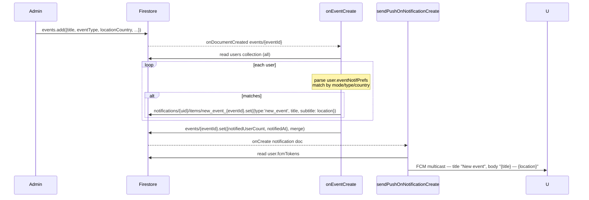

# Flow 08 — Events (browse, register, join chat, admin review)

User browses events on the Event tab → filters → opens detail → registers → admin approves → user is added as a member of the event group chat. Plus: notifications for new events that match a user's filter preferences.

## Sequence — registration

```mermaid
sequenceDiagram
  participant U as User
  participant List as Event tab / home_screen
  participant Detail as EventDetailScreen
  participant Sheet as EventRegistrationSheet
  participant ERS as EventRegistrationService
  participant FS as Firestore
  participant Admin as Admin (group settings)
  participant ECS as EventChatService

  U->>List: browse events; apply filters (type/city/field/level)
  U->>Detail: tap an event
  Detail->>FS: stream eventRegistrations/{eventId_uid} (my registration)
  U->>Sheet: tap Register
  Sheet->>ERS: submit(eventId, eventTitle, name, email, phone, countryCode)
  ERS->>FS: eventRegistrations/{eventId}_{uid}.set({status:'pending', createdAt, …})
  ERS-->>Sheet: success
  Sheet-->>Detail: snackbar "Submitted"
  Admin->>FS: stream eventRegistrations where eventId == X and status == 'pending'
  Admin->>ERS: approve(reg)
  ERS->>FS: eventRegistrations/{id}.update(status:'approved', reviewedAt, reviewedBy)
  ERS->>FS: notifications/{user}/items.add({type:'event_approved', actorUid: admin, targetId: eventId})
  Note over Admin: separately, admin adds the user to event chat<br/>(usually triggered from group settings list)
  Admin->>ECS: addMember(eventId, uid)
  ECS->>FS: eventChats/{eventId}/members/{uid}.set({uid, name, joinedAt, addedByAdmin:true})
  ECS->>FS: notifications/{user}/items.add({type:'event_invited', actorUid: admin, targetId: eventId})
```

## Sequence — new-event fan-out push



## Numbered steps — browse and register

1. **Browse the Event tab.** Either via the Event tab on home or a dedicated `EventScreen`. Filter chips on type / city / field / level rebuild a query against `events`. Events are streamed via [`admin_providers.dart`](../../lib/src/providers/admin_providers.dart) → `AdminService.streamEvents` / `streamEventsCreatedBy`. There is no published Cloud Function index by filter — filters apply client-side after a broad fetch.

2. **Tap an event** → `EventDetailScreen` (rendered from [`event_detail.dart`](../../lib/src/features/widgets/event_detail.dart) + [`event_screen.dart`](../../lib/src/features/screens/event_screen.dart)) displays the event card and registration controls.

3. **Open registration sheet.** [`EventRegistrationSheet`](../../lib/src/features/widgets/event_registration_sheet.dart) hydrates name/email/phone from the user profile if available.

4. **Submit.** `EventRegistrationSheet._submit` calls `eventRegistrationServiceProvider.submit(eventId, eventTitle, name, email, phone, countryCode)`.

5. **`EventRegistrationService.submit`** ([`event_registration_service.dart`](../../lib/src/services/event_registration_service.dart) lines 78–103):
   - Builds deterministic doc id `${eventId}_${uid}` so a user can only have one in-flight registration per event.
   - `eventRegistrations/{id}.set({eventId, eventTitle, userUid, name, email, phone, countryCode, status: 'pending', createdAt: serverTimestamp, reviewedAt: null, reviewedBy: null})`.

6. **Stream of my registration.** `EventRegistrationService.streamMine(eventId)` lets the detail screen reactively show "Pending review" / "Approved" / "Rejected" based on the current doc.

## Admin review

7. **Admin sees the queue.** `AdminService` paths and the [Admin Events screen](../../lib/src/features/screens/admin/admin_events_screen.dart) / [`event_group_settings_screen.dart`](../../lib/src/features/screens/event_group_settings_screen.dart) list pending registrations:
   - Globally: `EventRegistrationService.streamPending()` → `eventRegistrations.where('status','==','pending')`.
   - Per event (group settings): `streamPendingForEvent(eventId)`.

8. **Approve.** `EventRegistrationService.approve(reg)`:
   - `eventRegistrations/{id}.update({status: 'approved', reviewedAt: serverTimestamp, reviewedBy: admin.uid})`.
   - `NotificationService.createNotification(targetUid: reg.userUid, type: 'event_approved', actorUid: admin.uid, targetId: reg.eventId)` (auto-id; no FCM mapping → push falls through to the default branch).

9. **Reject.** Symmetric: `status: 'rejected'`, type `event_rejected`.

10. **Add to event chat.** The admin must also call `EventChatService.addMember(eventId, uid)` ([`event_chat_service.dart` lines 305–332](../../lib/src/services/event_chat_service.dart)). It's an admin action exposed in the group settings screen, **not** a side-effect of approval:
    - Reads `users/{uid}` for username.
    - `eventChats/{eventId}/members/{uid}.set({uid, name, joinedAt: serverTimestamp, addedByAdmin: true}, merge)`.
    - `NotificationService.createNotification(targetUid: uid, type: 'event_invited', actorUid: admin.uid, targetId: eventId)`.

    > **Decoupling note.** `approve` and `addMember` are independent operations. An approved user is **not** auto-added to the chat — the admin has to do it explicitly. There is no Cloud Function bridging the two.

11. **Member views chat.** `EventChatService.streamMyEventChats(uid)` combines two streams:
    - `collectionGroup('members').where('uid','==',uid)` for membership.
    - `eventChats.where('adminUid','==',uid)` so admins see their own chats even before any members join.

12. **Send a message in event chat.** `EventChatService.sendMessage(eventId, text, imageUrl?)` — admin-only by Firestore rules. Writes `eventChats/{eventId}/messages.add({...})` + merges chat summary on `eventChats/{eventId}`.

## New-event matching push

13. **Admin creates an event** via the admin dashboard. Eventually calls `AdminService.createEvent(title, subtitle, location, locationCountry, eventType, ...)` which writes `events/{id}`.

14. **Cloud Function `onEventCreate` fires.** [`functions/src/events.ts`](../../functions/src/events.ts):
    - Pulls every doc in `users`.
    - For each user, parses `user.eventNotifPrefs` (mode `all`/`off`, types list, countries list).
    - `wantsThisEvent` returns true when mode is `all` AND (types is empty OR event type matches) AND (countries is empty OR event country matches).
    - For each match, writes `notifications/{uid}/items/new_event_{eventId}.set({type: 'new_event', actorUid: '', targetId: eventId, title, subtitle: location, read: false, createdAt})`. Batched in chunks of 450.
    - Finally `events/{eventId}.set({notifiedUserCount, notifiedAt: serverTimestamp}, merge)` for an audit trail.

15. **`sendPushOnNotificationCreate` fires** for each new notification doc and maps `new_event` → title "New event", body "{title} — {location}".

16. **User taps push (cold-open).** `main.dart._handleFcmEvent` handles `type: 'new_event'`: opens `EventDetailScreen` for `targetId`. See [12-notification-flow.md](12-notification-flow.md).

## Firestore writes

| Step | Path | Operation |
|------|------|-----------|
| 5 | `eventRegistrations/{eventId}_{uid}` | `set` (status: 'pending') |
| 8 | `eventRegistrations/{id}` | `update(status: 'approved', reviewedAt, reviewedBy)` |
| 8 | `notifications/{user}/items/{auto-id}` | `add({type: 'event_approved'})` |
| 9 | `eventRegistrations/{id}` | `update(status: 'rejected', …)` |
| 9 | `notifications/{user}/items/{auto-id}` | `add({type: 'event_rejected'})` |
| 10 | `eventChats/{eventId}/members/{uid}` | `set(merge)` |
| 10 | `notifications/{user}/items/{auto-id}` | `add({type: 'event_invited'})` |
| 13 | `events/{id}` | `set` (admin only) |
| 14 (CF) | `notifications/{uid}/items/new_event_{eventId}` | `set` (deterministic id, fan-out) |
| 14 (CF) | `events/{id}` | `set({notifiedUserCount, notifiedAt}, merge)` |

## Cloud Functions triggered

- [`onEventCreate`](../../functions/src/events.ts) — fans out `new_event` notifications based on user prefs.
- [`sendPushOnNotificationCreate`](../../functions/src/notifications.ts) — pushes for `event_approved`, `event_rejected`, `event_invited`, `new_event`. Note: `event_approved` / `event_rejected` / `event_invited` are **not** explicitly mapped in the switch in `notifications.ts` → they fall through to the default "{actor} interacted with you" body. Push title/body for these is generic.

## Failure paths

- **Already registered.** `submit` re-writes the same doc (set, not add) — no error, no double-up. Status stays as whatever the admin last set; the user can re-submit a fresh `pending` only after the admin deletes the doc.
- **Network error during submit.** Sheet shows `eventRegFailed(e)`; user can retry.
- **Approve while admin not signed in.** Service throws `Exception('Not signed in')`.
- **Notification creation failed.** Swallowed — approval/rejection still committed; user just won't see the notification.
- **CF `onEventCreate` reads entire `users` collection.** Comment in source acknowledges this is expensive at scale; OK for current user base. If `notifiedUserCount` is 0, the audit field reflects that and admin can confirm no one matched the event's type/country.
- **User toggles `eventNotifPrefs.mode = 'off'` after event published.** They will still see the notification that was created at publish time (notifications are not retroactively pruned).

## Related files

- [`lib/src/services/event_registration_service.dart`](../../lib/src/services/event_registration_service.dart)
- [`lib/src/services/event_chat_service.dart`](../../lib/src/services/event_chat_service.dart)
- [`lib/src/services/admin_service.dart`](../../lib/src/services/admin_service.dart) — `createEvent`, event streams.
- [`lib/src/features/widgets/event_registration_sheet.dart`](../../lib/src/features/widgets/event_registration_sheet.dart)
- [`lib/src/features/widgets/event_detail.dart`](../../lib/src/features/widgets/event_detail.dart)
- [`lib/src/features/screens/event_screen.dart`](../../lib/src/features/screens/event_screen.dart)
- [`lib/src/features/screens/event_chat_screen.dart`](../../lib/src/features/screens/event_chat_screen.dart)
- [`lib/src/features/screens/event_group_settings_screen.dart`](../../lib/src/features/screens/event_group_settings_screen.dart)
- [`lib/src/features/screens/event_notifications_settings_screen.dart`](../../lib/src/features/screens/event_notifications_settings_screen.dart) — sets `user.eventNotifPrefs`.
- [`lib/src/features/screens/admin/admin_events_screen.dart`](../../lib/src/features/screens/admin/admin_events_screen.dart)
- [`lib/src/providers/event_registration_providers.dart`](../../lib/src/providers/event_registration_providers.dart)
- [`lib/src/providers/event_chat_providers.dart`](../../lib/src/providers/event_chat_providers.dart)
- [`functions/src/events.ts`](../../functions/src/events.ts)
