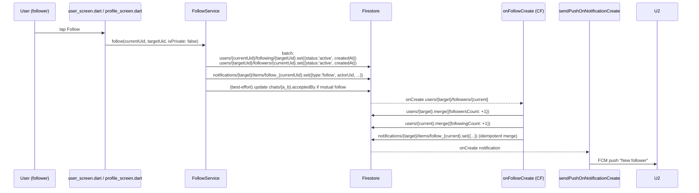
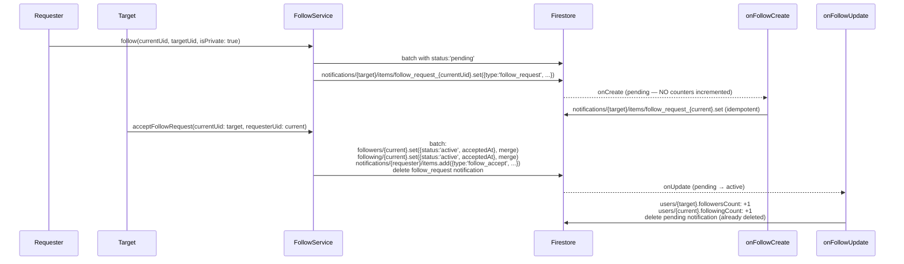

# Flow 09 — Follow / unfollow (public + private)

User taps Follow on someone's profile. For a public account the relationship is immediately active. For a private account it stays `pending` until the recipient accepts — only then are the follower / following counts incremented and a "follow" notification (vs a "follow_request") is created.

## Sequence — public account

## Sequence — private account request

## Numbered steps

### Public account (one-tap follow)

1. **Entry.** [`user_screen.dart`](../../lib/src/features/screens/user_screen.dart) or [`profile_screen.dart`](../../lib/src/features/screens/profile_screen.dart). The button state comes from `followServiceProvider.isFollowing(currentUid, targetUid)` / `hasRequestedFollow(...)` (see [`follow_providers.dart`](../../lib/src/providers/follow_providers.dart)).

2. **Tap Follow.** Calls `followServiceProvider.follow(currentUid, targetUid, isPrivate: target.isPrivate)`.

3. **`FollowService.follow`** ([`follow_service.dart`](../../lib/src/services/follow_service.dart) lines 61–98):
   - status = `'pending'` if private, else `'active'`.
   - Batch:
     - `users/{currentUid}/following/{targetUid}.set({uid: targetUid, createdAt, status})`.
     - `users/{targetUid}/followers/{currentUid}.set({uid: currentUid, createdAt, status})`.
   - `_promoteDirectChatIfMutualFollow(currentUid, targetUid)` — best-effort: if both directions are active, merges `chats/{a_b}.acceptedBy: arrayUnion([a, b])` so an existing 1:1 chat moves out of Requests.
   - Client-writes `notifications/{target}/items/follow_${currentUid}.set({type: 'follow' | 'follow_request', actorUid, targetId: currentUid, …})` with a deterministic id so follow → unfollow → refollow doesn't pile up duplicates.

4. **Cloud Function `onFollowCreate` fires.** [`functions/src/follows.ts`](../../functions/src/follows.ts):
   - Reads the new follower doc.
   - If not pending: `users/{target}.merge({followersCount: +1})` + `users/{current}.merge({followingCount: +1})`.
   - Always: `notifications/{target}/items/{follow_${current} | follow_request_${current}}.set({type, actorUid, targetId: followerUid, read: false, createdAt})` — deterministic id, collapses with the client-written doc.

5. **Push** via `sendPushOnNotificationCreate` for the new notification doc. `follow` → "New follower" / "{actor} started following you".

### Private account (request + accept)

6. **Follow on private account.** Same code path as step 3 with `isPrivate: true`. The `follow_request_{currentUid}` notification appears on the target.

7. **Target opens notifications** ([`NotificationScreen`](../../lib/src/features/screens/notification_screen.dart) → "Requests" category) and taps Accept / Decline. Or visits the Requests screen.

8. **Accept.** `FollowService.acceptFollowRequest(currentUid: target, requesterUid: requester)` ([`follow_service.dart` lines 133–203](../../lib/src/services/follow_service.dart)):
   - Reads `users/{target}/followers/{requester}` to confirm it exists (otherwise throws).
   - Batch:
     - `users/{target}/followers/{requester}.set({status: 'active', acceptedAt}, merge)`.
     - `users/{requester}/following/{target}.set({status: 'active', acceptedAt}, merge)`.
     - `notifications/{requester}/items/{auto-id}.set({type: 'follow_accept', actorUid: target, targetId: target})`.
     - Deletes `notifications/{target}/items/follow_request_{requester}` (clean up the open request from the target's list).
   - After commit, runs `_promoteDirectChatIfMutualFollow` again.

9. **Cloud Function `onFollowUpdate` fires.** [`functions/src/follows.ts` lines 59–121](../../functions/src/follows.ts):
   - Detects `pending → active`:
     - Increments `followersCount` on target and `followingCount` on requester.
     - Deletes the `follow_request_{requester}` notification doc on the target's items (idempotent — client also deleted it).
   - Reverse direction (`active → pending`, e.g. account flipped back to private) decrements counts and re-creates the pending notification.

10. **Decline.** `FollowService.rejectFollowRequest(currentUid: target, requesterUid: requester)`:
    - Calls `unfollow(currentUid: requester, targetUid: target)` to delete both subcollection docs.
    - Deletes the follow-request notification on the target's items (best-effort).
    - Note: there is **no** `follow_reject` notification sent back to the requester — the request just disappears.

### Unfollow

11. **`FollowService.unfollow`** ([`follow_service.dart` lines 100–131](../../lib/src/services/follow_service.dart)):
    - Batch deletes `following/{target}` and `followers/{current}`.
    - Best-effort deletes both deterministic notifications (`follow_{current}` and `follow_request_{current}`) on the target.

12. **Cloud Function `onFollowDelete` fires.** [`functions/src/follows.ts` lines 123–149](../../functions/src/follows.ts):
    - If the deleted doc was non-pending: decrements `followersCount` / `followingCount`.
    - Deletes the matching deterministic notification.

## Effect on feeds

- `feedProvider` in [`post_providers.dart`](../../lib/src/providers/post_providers.dart) combines `streamFeed` with `followService.getFollowing(currentUid)` and the blocked-users stream. So the moment the `following/{target}` doc flips to `active`, the follower's home feed re-renders to include the target's posts (private posts of the target become visible too via the `allowed = {following + currentUid}` set).
- `users/{target}/followers` is read by [`onPostCreate`](../../functions/src/posts.ts) when the target posts something new, so the new follower starts receiving timeline fan-outs on subsequent posts.

## Firestore writes

| Step | Path | Operation |
|------|------|-----------|
| follow | `users/{current}/following/{target}` | `set({status, createdAt})` |
| follow | `users/{target}/followers/{current}` | `set({status, createdAt})` |
| follow (public, CF) | `users/{target}.followersCount` | `+1` |
| follow (public, CF) | `users/{current}.followingCount` | `+1` |
| follow notif | `notifications/{target}/items/follow_{current}` or `follow_request_{current}` | `set` (client + CF, deterministic) |
| accept | `users/{target}/followers/{requester}` | `set({status:'active', acceptedAt}, merge)` |
| accept | `users/{requester}/following/{target}` | `set({status:'active', acceptedAt}, merge)` |
| accept | `notifications/{requester}/items/{auto-id}` | `add({type:'follow_accept'})` |
| accept | `notifications/{target}/items/follow_request_{requester}` | `delete` |
| accept (CF on update) | counters + cleanup (idempotent) |
| unfollow | both subcollection docs | `delete` |
| unfollow (CF) | counters | `-1` |
| unfollow (CF) | notifications | `delete` |
| (best-effort, multiple places) | `chats/{a_b}` | `update(acceptedBy: arrayUnion([a, b]))` if mutual |

## Cloud Functions triggered

- [`onFollowCreate`](../../functions/src/follows.ts) — counter init (for active), notif idempotent merge.
- [`onFollowUpdate`](../../functions/src/follows.ts) — handles `pending ↔ active` transitions.
- [`onFollowDelete`](../../functions/src/follows.ts) — decrements counters, deletes notification.
- [`sendPushOnNotificationCreate`](../../functions/src/notifications.ts) — pushes `follow` → "New follower". `follow_request` is not in the switch → falls through to generic body. `follow_accept` likewise.

## Failure paths

- **Follow yourself.** `follow` returns early when `currentUid == targetUid`.
- **Blocked.** If either side has the other in `blockedUsers`, the feed/visibility filtering hides the relationship effectively, but the follow write itself is governed by Firestore rules (see `firestore.rules`). UI gates the button on `BlockService.isBlockedBy`.
- **Accept when request doc was deleted in the meantime.** `acceptFollowRequest` throws `Exception('Follow request not found at path: …')`. UI catches and shows an error.
- **Reject failure.** Wrapped `Exception('Failed to reject follow request. Error: $e …')` so the UI can show an actionable error.
- **CF skipped.** Counters drift — `followersCount` / `followingCount` stay stale. Stream-derived UIs (subcollection cardinality) still reflect truth; counter-derived UIs (profile header) lag. Re-following / unfollowing can self-heal in some cases via CF.
- **Notification cleanup race.** Client + CF both delete the request notification on accept. Both ops are idempotent (`delete` on a missing doc is a no-op).

## Related files

- [`lib/src/services/follow_service.dart`](../../lib/src/services/follow_service.dart)
- [`lib/src/services/notification_service.dart`](../../lib/src/services/notification_service.dart)
- [`lib/src/providers/follow_providers.dart`](../../lib/src/providers/follow_providers.dart)
- [`lib/src/features/screens/user_screen.dart`](../../lib/src/features/screens/user_screen.dart)
- [`lib/src/features/screens/profile_screen.dart`](../../lib/src/features/screens/profile_screen.dart)
- [`lib/src/features/screens/request_screen.dart`](../../lib/src/features/screens/request_screen.dart)
- [`functions/src/follows.ts`](../../functions/src/follows.ts)
- [`functions/src/notifications.ts`](../../functions/src/notifications.ts) — push title/body for `follow`.
- [`firestore.rules`](../../firestore.rules) — controls who can write to followers/following subcollections.
