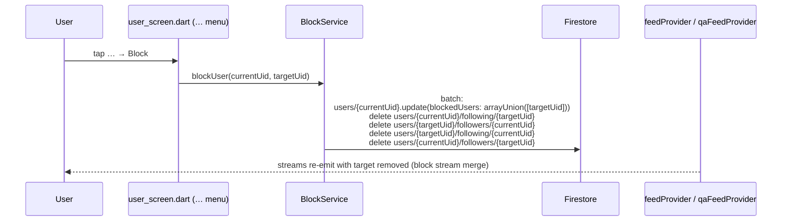
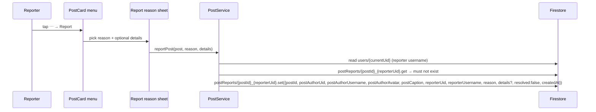
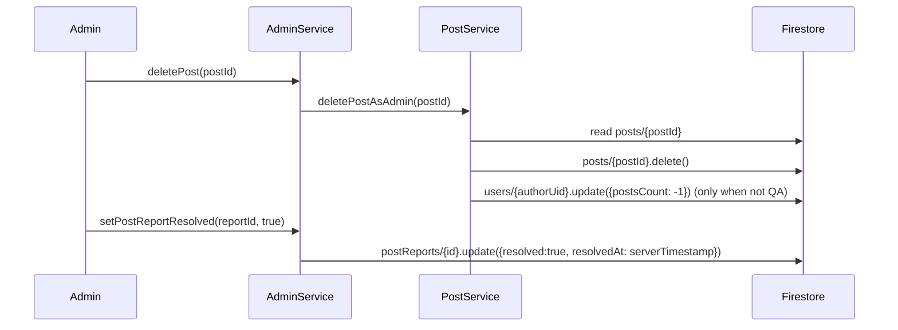
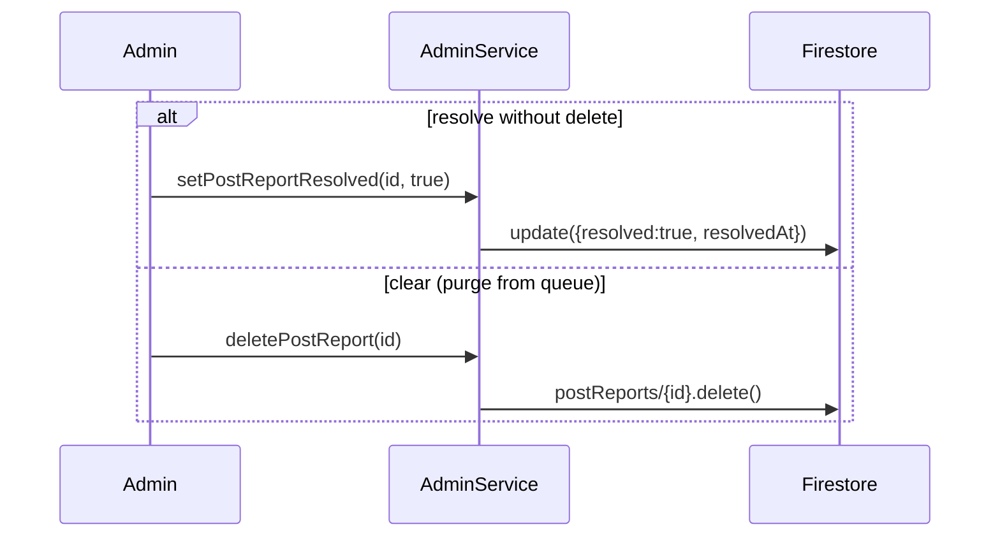

# Flow 10 — Block / Report / Admin disposition

Three related sub-flows: (a) blocking a user, (b) reporting a post / user / discuss thread, (c) the admin reviewing those reports and taking action.

## (a) Block a user

### Steps

1. **Open the target's profile** ([`user_screen.dart`](../../lib/src/features/screens/user_screen.dart)) and pick "Block" from the overflow menu.

2. **`BlockService.blockUser`** ([`block_service.dart`](../../lib/src/services/block_service.dart) lines 12–43):
   - Updates `users/{currentUid}.blockedUsers: arrayUnion([targetUid])`.
   - Deletes all four follow-relationship docs (current→target both directions). This avoids any leftover "still following" state on either side.
   - All in one atomic batch.

3. **Effects on feeds.**
   - `feedProvider` / `qaFeedProvider` ([`post_providers.dart`](../../lib/src/providers/post_providers.dart)) combine the post stream with `BlockService.getBlockedUsers(currentUid)` and filter posts where `authorUid` is in the blocked set.
   - The home story rail / message inbox / search / etc. all key their own filtering off the same `blockedUsers` array (read via `BlockService.isBlocked` / `getBlockedUsers`).

4. **Effect on the target.** They are NOT notified. They still see the blocker in normal lists (the rule is one-way client-side filtering). The blocker won't appear in their `followers` because step 2 deleted both directions.

5. **Unblock.** `BlockService.unblockUser` removes from `blockedUsers`. Follow relationships are NOT restored — the user has to re-follow manually.

### Firestore writes

| Path | Operation |
|------|-----------|
| `users/{currentUid}` | `update({blockedUsers: arrayUnion([target])})` |
| `users/{currentUid}/following/{target}` | `delete` |
| `users/{target}/followers/{currentUid}` | `delete` |
| `users/{target}/following/{currentUid}` | `delete` |
| `users/{currentUid}/followers/{target}` | `delete` |

No notifications, no Cloud Functions. The follow-delete CF will fire from the four follow doc deletes and decrement counters (see [09-follow-flow.md](09-follow-flow.md)).

## (b) Report a post / user / discuss thread

There are three separate collections, one per report type. Each report has a deterministic id `${targetId}_${reporterUid}` so a reporter can only file one report per target.

### (b.1) Report a post

[`PostService.reportPost`](../../lib/src/services/post_service.dart) lines 133–169. Path: `postReports/{postId}_{reporterUid}`.

### (b.2) Report a Discuss thread

[`PostService.reportQaPost`](../../lib/src/services/post_service.dart) lines 171–207. Same structure, different collection: `discussReports/{postId}_{reporterUid}`.

### (b.3) Report a user profile

[`UserService.reportUserProfile`](../../lib/src/services/user_service.dart) lines 93–129. Path: `userReports/{targetUid}_{reporterUid}` with fields `{targetUid, targetUsername, targetAvatar, reporterUid, reporterUsername, reason, details?, resolved: false, createdAt, resolvedAt: null}`.

### Common rules

- All three report types check for an existing doc first and throw `Exception('You already reported this …')` if present.
- A user cannot report their own post / question / profile — early throw.
- No Cloud Functions fire on report writes. The admin dashboard polls these collections via `AdminService` streams.

## (c) Admin reviews + takes action

Admin opens [`AdminDashboardScreen`](../../lib/src/features/screens/admin/admin_dashboard_screen.dart) which lists, among other things:
- Pending post reports → [`AdminPostReportsScreen`](../../lib/src/features/screens/admin/admin_post_reports_screen.dart).
- Pending discuss reports → [`AdminDiscussReportsScreen`](../../lib/src/features/screens/admin/admin_discuss_reports_screen.dart).
- Pending user reports → [`AdminUserReportsScreen`](../../lib/src/features/screens/admin/admin_user_reports_screen.dart).

Streams come from `AdminService.streamPostReports` / `streamDiscussReports` / `streamUserProfileReports` ([`admin_service.dart`](../../lib/src/services/admin_service.dart) lines 1022–1075), each ordered by `createdAt` desc and limited to 200 docs.

### Take down the post

### Or just dismiss

### Clear all solved reports

The admin reports toolbar ([`admin_reports_toolbar.dart`](../../lib/src/features/screens/admin/admin_reports_toolbar.dart)) typically loops over `streamPostReports` filtered to `resolved == true` and calls `deletePostReport` in batches.

### Steps

1. **Admin opens dashboard.** Admins are users with `role == 'admin'` (or sometimes `org_admin`). Gate is in [`admin_providers.dart`](../../lib/src/providers/admin_providers.dart) + Firestore rules.

2. **Stream reports.** `streamPostReports({limit: 200})` → `postReports.orderBy('createdAt', descending: true)`.

3. **Take action.** Each row exposes:
   - "Delete post" → `AdminService.deletePost(postId)` → `PostService.deletePostAsAdmin(postId)` which deletes `posts/{postId}` and decrements the author's `postsCount` (only if not a QA post — QA posts don't count toward `postsCount`).
   - "Resolve" → `setPostReportResolved(id, true)` flips the flag.
   - "Delete report" → `deletePostReport(id)` removes the doc entirely.
   - For user reports: `setUserProfileReportResolved` / `deleteUserProfileReport` / `AdminService.suspendUser(uid, true)` / `AdminService.deleteUser(uid)` (full wipe — see admin moderation flow).

4. **Notify the reporter?** **Not currently.** None of the resolve / delete actions emit a notification to the reporter. The "did the admin act on my report" status is only visible via the admin side. No `report_resolved` notification type exists in the codebase.

## Firestore writes — admin actions

| Action | Path | Operation |
|--------|------|-----------|
| delete post | `posts/{id}` | `delete` |
| delete post | `users/{author}.postsCount` | `-1` (non-QA only) |
| resolve report | `postReports/{id}` (or `discussReports`, `userReports`) | `update({resolved:true, resolvedAt})` |
| clear report | same collections | `delete` |
| suspend user | `users/{uid}.suspended` | `true` |
| delete user | `users/{uid}` + many cleanups | see `AdminService.deleteUser` |

No Cloud Function side-effects from these admin writes (no `onPostDelete` / `onReportResolved` triggers registered).

## Failure paths

- **Self-report.** Service throws "You cannot report your own post / question / profile."
- **Duplicate report.** Service throws "You already reported this …" — UI shows the error, no doc written.
- **`deletePost` while not signed in.** Admin service throws "Not signed in."
- **Delete post that doesn't exist.** `deletePostAsAdmin` early-returns when `snap.data() == null`. No counter decrement, no error.
- **Concurrent deletes** (admin + author both delete simultaneously). Second `delete` is a no-op. `postsCount -1` runs twice → goes -1 below truth. There's a self-heal path on next post creation that goes through the `streamUserPosts` cardinality but the counter field stays drifted.
- **Block + report.** A user can block AND report — the report sits in the admin queue independently of the block.

## Related files

- [`lib/src/services/block_service.dart`](../../lib/src/services/block_service.dart)
- [`lib/src/services/post_service.dart`](../../lib/src/services/post_service.dart) — `reportPost`, `reportQaPost`, `deletePostAsAdmin`.
- [`lib/src/services/user_service.dart`](../../lib/src/services/user_service.dart) — `reportUserProfile`.
- [`lib/src/services/admin_service.dart`](../../lib/src/services/admin_service.dart) — report streams + resolve/delete.
- [`lib/src/providers/block_providers.dart`](../../lib/src/providers/block_providers.dart)
- [`lib/src/features/screens/blocked_users_screen.dart`](../../lib/src/features/screens/blocked_users_screen.dart)
- [`lib/src/features/screens/admin/admin_post_reports_screen.dart`](../../lib/src/features/screens/admin/admin_post_reports_screen.dart)
- [`lib/src/features/screens/admin/admin_discuss_reports_screen.dart`](../../lib/src/features/screens/admin/admin_discuss_reports_screen.dart)
- [`lib/src/features/screens/admin/admin_user_reports_screen.dart`](../../lib/src/features/screens/admin/admin_user_reports_screen.dart)
- [`lib/src/features/screens/admin/admin_reports_toolbar.dart`](../../lib/src/features/screens/admin/admin_reports_toolbar.dart)
- [`firestore.rules`](../../firestore.rules) — who can write reports + admin role check.
