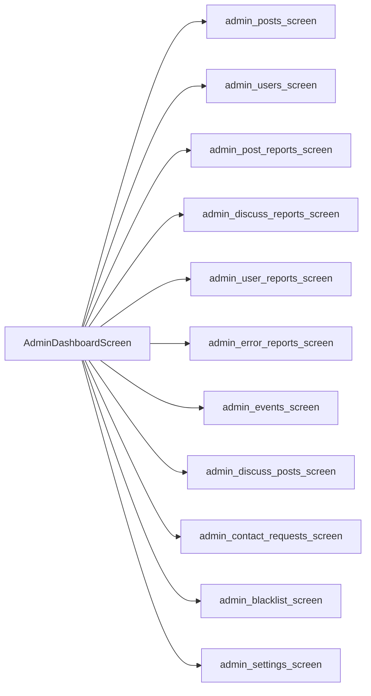
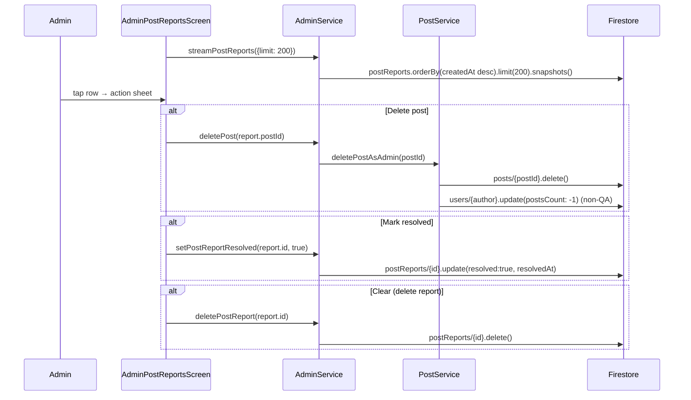

# Flow 11 — Admin moderation dashboard

The admin dashboard surfaces every queue an admin needs (reports, users, posts, events, contact requests, blacklist, settings). Admins are users with `role == 'admin'`; `org_admin` is a scoped role for event organizers. RBAC is enforced both client-side (UI gating) and in `firestore.rules`.

## Dashboard layout

## Entry gate

[`AdminDashboardScreen`](../../lib/src/features/screens/admin/admin_dashboard_screen.dart) checks `isAdminProvider` from [`admin_providers.dart`](../../lib/src/providers/admin_providers.dart). If the current user's `role != 'admin'`, the screen short-circuits to a "no access" message. Org admins have a separate gate, scoped to events they created (see `streamEventsCreatedBy`).

`hasAnyNewReportsProvider` (in [`admin_report_notifications_provider.dart`](../../lib/src/providers/admin_report_notifications_provider.dart)) is what surfaces a red dot on the admin button in profile if any of post/discuss/user/error report queues have unresolved items.

## Sub-flows

### Review and act on post reports

[Source: `admin_service.dart` lines 1018–1075](../../lib/src/services/admin_service.dart) and [`post_service.dart` lines 656–675](../../lib/src/services/post_service.dart).

### Review and act on user reports

Same shape with `userReports` collection and `AdminUserReportsScreen`. Actions include:

- **Suspend.** `AdminService.suspendUser(uid, true)` → `users/{uid}.update({suspended: true})`. Suspended users are excluded from event notification fan-outs (`onEventCreate` checks `if (u.suspended === true) continue;`).
- **Delete user.** `AdminService.deleteUser(uid)` ([lines 749–833](../../lib/src/services/admin_service.dart)) cascade-deletes:
  - `posts where authorUid == uid` (each with `likes`, `comments`, `reposts` subcollections).
  - `stories where authorUid == uid` (with `viewers`).
  - **Comments authored by the user are intentionally preserved** on other people's posts — the comment tile renders "deleted user" once the author doc is gone.
  - `chats where participants array-contains uid` (with `messages`).
  - All subcollections under `users/{uid}` (`followers`, `following`, `reposts`, `saved`, `savedTranslations`).
  - `collectionGroup('followers')` and `collectionGroup('following')` where `uid == target` — wipes the deleted user from everyone else's relations.
  - `notifications/{uid}/items` recursively.
  - `eventRegistrations where userUid == uid`.
  - Finally `users/{uid}.delete()`.
  - Adds `blacklist/{email}` with `{email, uid, deletedAt}` so the email can't sign back in (the `authStateProvider` flow + the rules check this).
  - **Caveat (Spark plan).** Firebase Auth record is NOT deleted from the client — that requires the `adminDeleteUser` Cloud Function (not deployed). The email stays locked in Auth but is blacklisted, and the signup flow surfaces "this email has been deleted".
- **Set role.** `AdminService.setRole(uid, role)` ([lines 712–744](../../lib/src/services/admin_service.dart)) updates `users/{uid}.role` and writes a `role_update` **system notification** via `NotificationService.createSystemNotification` with a human-readable title/subtitle ("Iter Team made you an admin." etc).

### Take down a Discuss thread

`AdminDiscussReportsScreen` mirrors the post path. To delete a Discuss thread the admin uses `AdminService.deletePost(postId)` (same path — QA topics live in `posts` with `postType: 'qa'`, and `deletePostAsAdmin` checks `postType` to skip the `postsCount` decrement for QA).

### Clear resolved reports

Toolbar in [`admin_reports_toolbar.dart`](../../lib/src/features/screens/admin/admin_reports_toolbar.dart) typically scans for `resolved == true` reports and bulk-deletes them via the corresponding `delete*Report` method.

### Error reports

[`AdminErrorReportsScreen`](../../lib/src/features/screens/admin/admin_error_reports_screen.dart) reads `errorReports` collection (written by `ErrorReportService` when an unhandled exception fires in the app) and offers resolve/delete.

### Contact requests

[`AdminContactRequestsScreen`](../../lib/src/features/screens/admin/admin_contact_requests_screen.dart) reads `contactRequests` (written by [`contact_us_screen.dart`](../../lib/src/features/screens/contact_us_screen.dart) / [`contact_request_service.dart`](../../lib/src/services/contact_request_service.dart)).

### Admin settings

[`AdminSettingsScreen`](../../lib/src/features/screens/admin/admin_settings_screen.dart) writes the singleton config doc that backs `AdminConfig` ([`admin_service.dart`](../../lib/src/services/admin_service.dart)). Editable settings include: feature toggles (`storiesEnabled`, `repostsEnabled`, `translateEnabled`), announcement banner, maintenance mode, min app version (gates the `LowAppVersionScreen` shown in `main.dart`), contact email, store URLs, event types, personalization options, profanity words list.

### Blacklist

[`AdminBlacklistScreen`](../../lib/src/features/screens/admin/admin_blacklist_screen.dart) reads/writes `blacklist/{email}`. Used to:
- Block specific emails from signing up (entries written by `deleteUser` and `selfDeleteCurrentUser`).
- Manually add entries via admin UI.
- Surface entries so admin can remove them (`delete` if appeal is granted).

## Do admins notify reporters?

**No.** None of the admin actions currently produce a `report_resolved` notification back to the reporter. The reporter only sees "your report was filed" toast at submit time. The disposition is invisible to them. Same for blocked/suspended users — they receive no notification of admin action against them (except for `setRole` which produces a `role_update` system notification).

## Firestore writes

| Action | Path | Operation |
|--------|------|-----------|
| resolve report | `{postReports|discussReports|userReports}/{id}` | `update({resolved, resolvedAt})` |
| delete report | same | `delete` |
| delete post | `posts/{id}` | `delete` |
| suspend | `users/{uid}.suspended` | `bool` |
| set role | `users/{uid}.role` | `string`; `notifications/{uid}/items.add({type:'role_update', title, subtitle, actorUid:''})` |
| delete user (admin) | many paths (see above) | cascade `delete`; `blacklist/{email}.set` |
| admin settings | `config/admin` (or similar singleton) | `set(merge: true)` |
| blacklist add/remove | `blacklist/{email}` | `set` / `delete` |

## Cloud Functions

- None of the admin moderation actions have explicit Cloud Function triggers. Counter side-effects propagate via the normal triggers (e.g. each follow-doc delete during `deleteUser` fires `onFollowDelete`, which decrements counters and deletes notifications).
- `adminUsers` module ([`functions/src/adminUsers.ts`](../../functions/src/adminUsers.ts)) exists in the source tree — see that file for any deployed callable functions related to admin user management.

## Failure paths

- **Admin operation while not authenticated.** Service throws `Exception('Not signed in')`.
- **Cascade delete partially fails.** `deleteUser` does sequential awaits — a midway failure leaves earlier deletes committed and a partially-broken account. The next attempt is idempotent (each step starts with a `get`/`where`, deletes only what's still there).
- **`blacklist/{email}` write rejected.** Try/catch swallows in `selfDeleteCurrentUser`. Admin path doesn't swallow — admin would see the exception.
- **Firestore rules drift.** If rules don't permit admin to traverse a collection (e.g. `collectionGroup('followers')`), the cascade silently leaves orphan docs. Add a self-heal pass in the relevant screen if needed.

## Related files

- [`lib/src/features/screens/admin/admin_dashboard_screen.dart`](../../lib/src/features/screens/admin/admin_dashboard_screen.dart)
- [`lib/src/features/screens/admin/admin_post_reports_screen.dart`](../../lib/src/features/screens/admin/admin_post_reports_screen.dart)
- [`lib/src/features/screens/admin/admin_discuss_reports_screen.dart`](../../lib/src/features/screens/admin/admin_discuss_reports_screen.dart)
- [`lib/src/features/screens/admin/admin_user_reports_screen.dart`](../../lib/src/features/screens/admin/admin_user_reports_screen.dart)
- [`lib/src/features/screens/admin/admin_error_reports_screen.dart`](../../lib/src/features/screens/admin/admin_error_reports_screen.dart)
- [`lib/src/features/screens/admin/admin_events_screen.dart`](../../lib/src/features/screens/admin/admin_events_screen.dart)
- [`lib/src/features/screens/admin/admin_posts_screen.dart`](../../lib/src/features/screens/admin/admin_posts_screen.dart)
- [`lib/src/features/screens/admin/admin_discuss_posts_screen.dart`](../../lib/src/features/screens/admin/admin_discuss_posts_screen.dart)
- [`lib/src/features/screens/admin/admin_contact_requests_screen.dart`](../../lib/src/features/screens/admin/admin_contact_requests_screen.dart)
- [`lib/src/features/screens/admin/admin_users_screen.dart`](../../lib/src/features/screens/admin/admin_users_screen.dart)
- [`lib/src/features/screens/admin/admin_blacklist_screen.dart`](../../lib/src/features/screens/admin/admin_blacklist_screen.dart)
- [`lib/src/features/screens/admin/admin_settings_screen.dart`](../../lib/src/features/screens/admin/admin_settings_screen.dart)
- [`lib/src/features/screens/admin/admin_reports_toolbar.dart`](../../lib/src/features/screens/admin/admin_reports_toolbar.dart)
- [`lib/src/services/admin_service.dart`](../../lib/src/services/admin_service.dart) — central, includes `AdminConfig`, role assignment, cascade delete, error/report streams.
- [`lib/src/services/post_service.dart`](../../lib/src/services/post_service.dart) — `deletePostAsAdmin`.
- [`lib/src/providers/admin_providers.dart`](../../lib/src/providers/admin_providers.dart) — `isAdminProvider`, `adminConfigProvider`, report streams.
- [`lib/src/providers/admin_report_notifications_provider.dart`](../../lib/src/providers/admin_report_notifications_provider.dart) — dashboard badge.
- [`firestore.rules`](../../firestore.rules) — admin role and permission gates.
