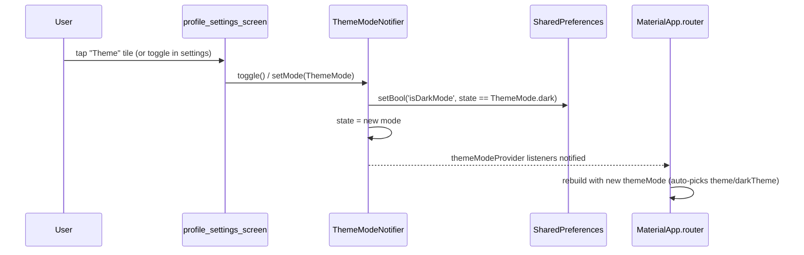

# Flow 13 — Language and theme toggles

User toggles between English / Arabic / Kurdish Sorani in Settings, or flips light ↔ dark theme. Both are persisted in SharedPreferences and propagated through Riverpod so `MaterialApp` rebuilds with the new value and every `context.t.*` lookup hits the new string map.

## Language toggle

```mermaid
sequenceDiagram
  participant U as User
  participant Lang as LanguageScreen
  participant N as LocaleNotifier
  participant Prefs as SharedPreferences
  participant App as MaterialApp.router

  U->>Lang: tap a language tile
  Lang->>N: setLanguage(AppLanguage)
  N->>Prefs: setString('app_ui_language', code)
  N->>N: state = language
  N-->>App: localeProvider listeners notified
  App->>App: rebuild with new locale + textDirection
  Note over App: context.t lookups now hit the chosen<br/>l10n/strings_*.dart map; RTL applied for ar / ckb
```

### Numbered steps — language

1. **Open Settings → Language.** Routed to [`LanguageScreen`](../../lib/src/features/screens/language_screen.dart) (route `/language`).

2. **Tap a tile.** `ref.read(localeProvider.notifier).setLanguage(lang)` (see [`language_screen.dart` line 45](../../lib/src/features/screens/language_screen.dart)).

3. **`LocaleNotifier.setLanguage`** ([`locale_provider.dart`](../../lib/src/providers/locale_provider.dart) lines 72–76):
   - Early-return if equal.
   - Sets `state = language` (this notifies all listeners synchronously).
   - `_prefs.setString('app_ui_language', language.code)` — fire and forget; not awaited.

4. **MaterialApp rebuilds.** [`main.dart`](../../lib/main.dart) `build` does `final language = ref.watch(localeProvider);` and passes:
   - `locale: language.locale` (BCP-47 code wrapped in `Locale`).
   - `supportedLocales: [...AppLanguage.values.map((l) => l.locale)]`.
   - `localizationsDelegates: [GlobalMaterialLocalizations.delegate, GlobalCupertinoLocalizations.delegate, GlobalWidgetsLocalizations.delegate, AppStrings.delegate]`.
   - In `MaterialApp.builder`, wraps child in a `Directionality(textDirection: language.direction)` so Arabic and Kurdish flip to RTL.

5. **`context.t` resolves to the new map.** `AppStrings` ([`lib/src/l10n/app_strings.dart`](../../lib/src/l10n/app_strings.dart)) is the localizations delegate. Each language has its own static string map (`strings_en.dart`, `strings_ar.dart`, `strings_ckb.dart`). `context.t.someKey` calls into the active locale's map and falls back to English if a key is missing.

6. **Persistence.** First-launch logic ([`locale_provider.dart` lines 63–70](../../lib/src/providers/locale_provider.dart)): if `SharedPreferences` has no `app_ui_language`, read `ui.PlatformDispatcher.instance.locale.languageCode` and pick that if supported; otherwise English. Subsequent launches use the saved value.

### Supported languages

| `code` | English | Native | Direction |
|--------|---------|--------|-----------|
| `en`   | English | English | LTR |
| `ar`   | Arabic | العربية | RTL |
| `ckb`  | Kurdish (Sorani) | کوردیی ناوەندی | RTL |

ISO-639-3 `ckb` (Central Kurdish) is used per Flutter's locale matching.

## Theme toggle



### Numbered steps — theme

1. **Open Settings.** The theme toggle is typically in [`profile_settings_screen.dart`](../../lib/src/features/screens/profile_settings_screen.dart) or another settings screen.

2. **Toggle.** `ref.read(themeModeProvider.notifier).toggle()` or `.setMode(ThemeMode.dark)`.

3. **`ThemeModeNotifier`** ([`theme_provider.dart`](../../lib/src/providers/theme_provider.dart)):
   - `toggle()` flips between `light` and `dark`.
   - `setMode(mode)` writes a specific mode.
   - Both persist via `_prefs.setBool('isDarkMode', state == ThemeMode.dark)`.

4. **MaterialApp rebuilds.** `main.dart` watches `themeModeProvider` and passes:
   - `theme: AppTheme.light` ([`lib/src/theme/app_theme.dart`](../../lib/src/theme/app_theme.dart))
   - `darkTheme: AppTheme.dark`
   - `themeMode: themeMode`
   
   Flutter swaps between them based on the active value.

5. **Status bar overlay.** `main.dart._configureSystemUi(appBrightness: …)` is also re-invoked on app resume and on rebuild — it sets `SystemUiOverlayStyle` so the status bar icons stay legible against the new theme.

6. **Default.** [`theme_provider.dart` line 21](../../lib/src/providers/theme_provider.dart): initial value is `dark` unless `isDarkMode == false` is explicitly stored (i.e. first launch defaults to dark).

## SharedPreferences setup

`sharedPreferencesProvider` ([`theme_provider.dart`](../../lib/src/providers/theme_provider.dart) lines 5–9) throws unless overridden in `ProviderScope`. In `main.dart`'s `main()`:
```dart
final prefs = await SharedPreferences.getInstance();
runApp(ProviderScope(
  overrides: [sharedPreferencesProvider.overrideWithValue(prefs)],
  child: MyApp(),
));
```
This guarantees the providers can read prefs synchronously at startup and stay in sync as the user changes them.

## Firestore writes

**None.** Both toggles are local-only via SharedPreferences. The user doc has no `language` / `theme` field — preferences are per-device.

## Cloud Functions

None.

## Failure paths

- **SharedPreferences write fails.** `setString` / `setBool` return `false`. The in-memory state is still updated, so the change applies for this session but reverts on next cold start. Failure is silent.
- **Unsupported device locale (first launch).** `AppLanguage.fromCode` falls back to English.
- **Missing translation key.** `AppStrings._get` falls back to the English map; if the key is missing from English too it returns the key name itself (visible developer fallback).

## Related files

- [`lib/src/providers/locale_provider.dart`](../../lib/src/providers/locale_provider.dart)
- [`lib/src/providers/theme_provider.dart`](../../lib/src/providers/theme_provider.dart)
- [`lib/src/providers/preferred_language_provider.dart`](../../lib/src/providers/preferred_language_provider.dart) — separate from UI locale; tracks the user's preferred translation target language.
- [`lib/src/features/screens/language_screen.dart`](../../lib/src/features/screens/language_screen.dart)
- [`lib/src/features/screens/profile_settings_screen.dart`](../../lib/src/features/screens/profile_settings_screen.dart)
- [`lib/src/l10n/app_strings.dart`](../../lib/src/l10n/app_strings.dart) — the `AppStrings` delegate + `context.t` extension.
- [`lib/src/l10n/`](../../lib/src/l10n/) — string maps per language.
- [`lib/src/theme/app_theme.dart`](../../lib/src/theme/app_theme.dart) — `AppTheme.light`, `AppTheme.dark`, `AppColors`.
- [`lib/main.dart`](../../lib/main.dart) — `MaterialApp.router` wiring, `_configureSystemUi`.
